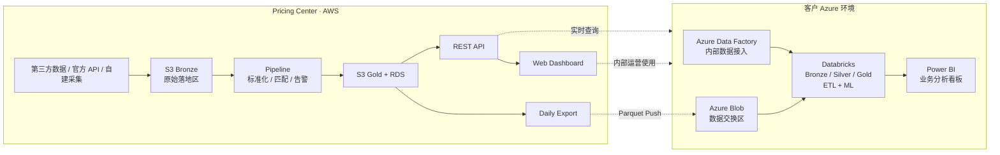
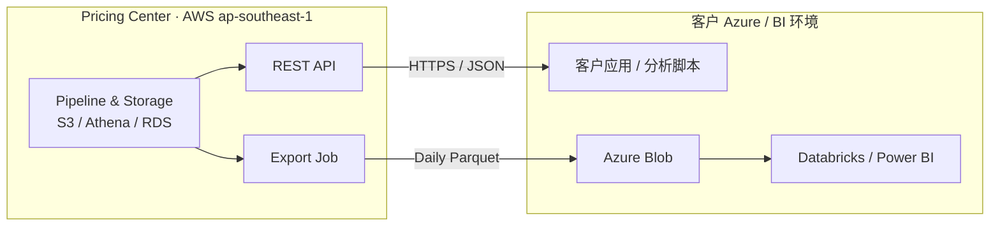
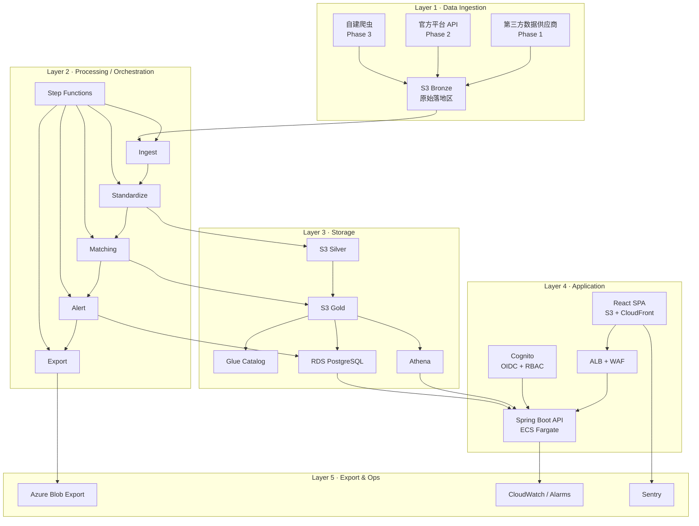

# Pricing Center — 正式架构方案

---

## 核心决策摘要

| 主题     | 结论与说明                                                                                   |
| -------- | -------------------------------------------------------------------------------------------- |
| 云平台   | **AWS** `ap-southeast-1`<br>理由：独立于客户 Azure、SEA 成本更优、交付路径更短               |
| 数据采集 | **先买后建**<br>路径：Phase 1 买第三方数据 → Phase 2 接官方 API → Phase 3 自建采集           |
| 分析引擎 | **Athena Serverless**<br>理由：替代 ClickHouse，按查询计费，当前规模月费可控制在低位         |
| 认证方案 | **AWS Cognito**<br>理由：替代 MVP 中的 Keycloak，全托管、OIDC 兼容、运维更轻                 |
| 客户对接 | **REST API + S3/Azure Blob 导出**<br>理由：既支持系统接入，也支持 Databricks / Power BI 消费 |
| 成本结构 | **基础设施约 $70-100/月**，**数据采购约 $2-5K/月**<br>说明：成本大头是外部数据，不是云资源   |
| 推进节奏 | **预计约 4 个月进入稳定上线**<br>说明：前期完成基础链路和 staging，后续完成生产上线与稳定化  |

---

## 1. 背景与现状

### 1.1 客户已有的 Azure 环境

客户目前在 Azure 上已经搭建了一整套数据处理链路：

```
内部销售数据 ──→ Azure Data Factory ──→ Databricks (Bronze→Silver→Gold) ──→ ML Models ──→ Power BI 看板
```

**这条链路处理的是客户内部的销售数据**（门店 POS、库存、供应链等）。客户已有：

- **Azure Data Factory (ADF)**：负责内部数据的 ETL ingestion
- **Databricks**：三层 Lakehouse 架构（Bronze → Silver → Gold），跑 ETL 任务和 ML 模型
- **Power BI**：面向业务团队的可视化看板

### 1.2 客户环境可复用性分析

> **核心问题：客户现有的 ingestion pipeline 哪些可用？**

| 组件               | 判断        | 说明                                                                                                              |
| ------------------ | ----------- | ----------------------------------------------------------------------------------------------------------------- |
| Azure Data Factory | ❌ 不复用   | 当前处理的是客户内部销售数据，不是竞品价格数据；源头完全不同。<br>替代：我方使用 S3 + Step Functions 自建接入链路 |
| Databricks ETL     | ❌ 不复用   | 对当前数据规模而言成本偏高，性价比不合适。<br>替代：ECS Fargate Task 批处理                                       |
| Databricks ML      | 🔜 后期考虑 | Phase 1 先用现有规则匹配；若后续需要 ML matching，再评估接入                                                      |
| Power BI           | ✅ 对接输出 | 继续让客户在既有 BI 体系中消费数据；我们提供数据源，不替代 Power BI                                               |
| Azure Blob Storage | ✅ 对接输出 | 作为跨云数据交换落点，承接我方导出的 Parquet 数据                                                                 |

**结论：** 客户 Azure 链路处理的是内部数据，和竞品价格采集是完全不同的数据源。**我们是一个独立产品，输出数据给客户**，不需要复用客户 pipeline 本身。但需要做好数据对接——让客户可以通过 Power BI 或 API 消费我们的数据。

### 1.3 关系定位



### 1.4 MVP 代码复用

已完成 MVP 包含 9 个仓库 / 22K+ 行代码 / 100+ 测试用例。以下是各模块的复用策略：

| 模块                 | 当前价值                                    | 生产改造重点                         |
| -------------------- | ------------------------------------------- | ------------------------------------ |
| **matching-engine**  | 直接复用；核心 IP 不变                      | 主要做输入输出适配到 S3              |
| **data-pipeline**    | 复用品牌标准化、规格解析、DQ 检查等核心逻辑 | 将 ingestion 层改为 S3 读取          |
| **shared-contracts** | 直接复用 OpenAPI 与 Schema 契约             | 保持前后端共享定义一致               |
| **api-backend**      | 复用现有接口层设计与 9 个 endpoints         | 存储层从 DuckDB/H2 切到 RDS + Athena |
| **web-frontend**     | 复用现有页面骨架与主要交互流                | 完成 Dashboard 产品化与可视化增强    |
| **infra**            | 复用 Terraform / Compose 模板思路           | 替换为生产账号、生产参数和环境配置   |

---

## 2. 产品定位与价值

### 2.1 我们做什么 vs 客户有什么

| 能力                   |      客户已有       |              我们补什么              | 价值               |
| ---------------------- | :-----------------: | :----------------------------------: | ------------------ |
| 内部销售数据处理       | ✅ ADF + Databricks |                  —                   | 已有               |
| **竞品价格数据采集**   |         ❌          |         **✅ 核心产品功能**          | 获取市场竞争信息   |
| **跨平台商品匹配**     |         ❌          |            **✅ 核心 IP**            | 同款商品跨平台对齐 |
| **价格异常检测与预警** |         ❌          |           **✅ 产品功能**            | 实时发现竞品动态   |
| **机会清单与行动建议** |         ❌          |           **✅ 产品功能**            | 可执行的定价策略   |
| BI 看板                |     ✅ Power BI     | 独立 Dashboard + 数据导出到 Power BI | 双通道输出         |

### 2.2 产品数据流

```
┌───────────────────┐     ┌────────────────────────────┐     ┌───────────────────┐
│   数据采集层       │     │     Pricing Center 核心     │     │    产品输出层       │
│                   │     │                            │     │                   │
│  Shopee TH        │     │  品牌/规格标准化            │     │  Web Dashboard    │
│  TikTok Shop TH   │────→│  跨平台商品匹配 (4-stage)  │────→│  REST API         │
│  Lazada TH        │     │  价格异常检测              │     │  Power BI 导出    │
│  (第三方数据供应商) │     │  机会清单生成              │     │  Alert 推送       │
└───────────────────┘     └────────────────────────────┘     └───────────────────┘
```

### 2.3 MVP → 生产 变更清单

| 维度   | MVP 状态             | 生产目标                         | 变更代价 |
| ------ | -------------------- | -------------------------------- | :------: |
| 数据源 | Stub YAML 模拟数据   | 第三方购买 + 平台 API + 自建爬虫 |    高    |
| 品类   | personal_care 单品类 | 多品类分阶段扩展                 |    中    |
| 区域   | 泰国 (TH)            | 东南亚多国 (MY/ID/VN/SG)         |    中    |
| 部署   | Docker Compose 本地  | AWS 生产级 (ECS + S3 + RDS)      |    高    |
| 存储   | DuckDB 单文件        | S3 + Athena (OLAP) + RDS (OLTP)  |    高    |
| 认证   | Keycloak 自建        | Cognito 全托管                   |    低    |
| SLA    | 无                   | 99.5% 可用性，数据延迟 <2h       |    中    |

---

## 3. 云平台选型：为什么选 AWS

> **核心问题：选 Azure 还是 AWS 还是 GCP？**

### 3.1 对比评估

| 评估维度     |  Azure  |  **AWS**  |   GCP   | 说明                                         |
| ------------ | :-----: | :-------: | :-----: | -------------------------------------------- |
| SEA 区域覆盖 |   ★★★   | **★★★★★** |  ★★★★   | AWS 新加坡+雅加达+曼谷，覆盖最全             |
| 成本         |   ★★★   | **★★★★★** |  ★★★★   | Athena 按查询计费，小数据量时成本极低        |
| 数据生态     |  ★★★★   | **★★★★★** |  ★★★★   | S3/Glue/Athena/Step Functions 一站式         |
| 团队熟悉度   |   ★★    | **★★★★★** |   ★★★   | 团队有深度 AWS 经验                          |
| 产品独立性   |    ★    | **★★★★★** |  ★★★★★  | 部在客户 Azure = 每客户一套；自己 AWS = SaaS |
| **综合得分** | **3.0** |  **4.8**  | **3.9** | —                                            |

### 3.2 选 AWS 的三个核心理由

**理由一：产品独立性**

- 自己的 AWS 账号 = 一套代码服务所有客户（SaaS 模式）
- 如果部在客户 Azure 上 = 每个客户维护一套，运维成本随客户数线性增长
- 未来扩展多客户时，AWS 独立部署的优势会指数级放大

**理由二：成本悬殊**

- Athena 按扫描量计费：$5/TB，当前数据量月费 <$20
- Databricks 按 DBU 计费：$0.4/DBU，即使不跑也有底费 $100-300/月
- 总基础设施成本：AWS $70-100/月 vs Azure 等效方案 $300-500/月

**理由三：运维自主权**

- AWS 自有账号：IAM/网络/部署完全自主
- 客户 Azure：需要客户 Azure admin 授权、网络打通、合规审批
- 独立运维权限越高，整体落地效率越高

### 3.3 客户对接方案

我们在 AWS 上独立运行，通过以下方式将数据推送给客户：



**三种对接模式（按优先级）：**

| 模式         | 实现方式                       | 复杂度 |    阶段     | 说明                         |
| ------------ | ------------------------------ | :----: | :---------: | ---------------------------- |
| **REST API** | 客户系统直接调用 HTTPS API     |   低   | **Phase 1** | 最快上线，实时查询           |
| **数据推送** | 每日 Parquet 文件 → Azure Blob |   中   |   Phase 2   | 客户接入 Databricks/Power BI |
| **Power BI** | Custom Connector / DirectQuery |   高   |    按需     | 客户 BI 团队自助分析         |

**责任边界（RACI 简化版）：**

| 事项                       | 我方负责       | 客户负责             | 备注                                   |
| -------------------------- | -------------- | -------------------- | -------------------------------------- |
| 竞品价格数据采集           | ✅             | ❌                   | 第三方供应商 / API / 爬虫由我方管理    |
| 数据标准化 / 匹配 / 告警   | ✅             | ❌                   | 核心产品能力                           |
| AWS 运行环境               | ✅             | ❌                   | 包含 S3 / ECS / RDS / Athena / Cognito |
| Azure Blob 接收区          | △ 提供落库格式 | ✅                   | 客户提供存储账户、权限与网络策略       |
| Databricks / Power BI 消费 | ❌             | ✅                   | 客户自行接入或双方联合联调             |
| 生产支持与故障排查         | ✅（产品侧）   | ✅（客户侧消费链路） | 以接口边界划分                         |

**交付物清单（对客户/内部可承诺）：**

- Web Dashboard（内部/客户业务侧可用）
- REST API（OpenAPI 契约稳定）
- Daily Parquet Export（面向客户 Azure Blob）
- 数据字典与字段说明
- 运行监控与告警机制
- 上线与回滚 Runbook

### 3.4 风险登记簿

| 风险                 | 判断         | 主要缓解措施                               | 兜底方案                              |
| -------------------- | ------------ | ------------------------------------------ | ------------------------------------- |
| 客户要求部署到 Azure | 🟡 中 / 短期 | 全容器化设计，优先推动 API 对接模式        | 单独评估 Azure 落地方案并报价         |
| 第三方数据质量不达标 | 🟡 中 / 短期 | 并行评估 2-3 家供应商，先用样本跑验证      | 启动后续自建采集方案                  |
| 平台反爬升级         | 🟡 中 / 长期 | Phase 1 不依赖爬虫，Phase 2 优先接官方 API | 换供应商或评估商业合作                |
| AWS 区域故障         | 🟢 低 / 长期 | Multi-AZ 部署，S3 默认跨 AZ 冗余           | 切备用 region                         |
| 数据跨境合规（PDPA） | 🟢 低 / 长期 | 数据驻留新加坡，不采集 PII                 | 再评估本地 region                     |
| Athena 查询延迟偏高  | 🟢 低 / 中期 | 做分区、缓存和查询优化                     | 增加 Redis 或迁移 Redshift Serverless |
| 数据供应商涨价或断供 | 🟡 中 / 长期 | 不单一依赖单家供应商                       | 加速 API / 自建采集替代               |
| 关键人依赖风险       | 🟡 中 / 长期 | 强化文档、规范、CI/CD 和知识共享           | 培养可接手的工程能力                  |

---

## 4. 系统架构

### 4.1 五层架构总览

整个系统分为 5 层，自下而上：



### 4.2 Layer 1：数据采集 — 先买后建策略

> **核心问题：爬虫和第三方数据放在哪里？数据一开始去买靠谱吗？**

**策略：Phase 1 先买，Phase 2 接 API，Phase 3 自建爬虫。**

买数据是最快、最稳、合规风险最低的启动方式。理由如下：

| 维度     |  购买第三方数据  |  官方平台 API  |       自建爬虫        |
| -------- | :--------------: | :------------: | :-------------------: |
| 上线速度 |  ★★★★★ 签约即用  | ★★★ 需申请审批 |    ★★ 需开发+维护     |
| 数据质量 |   ★★★★ 清洗过    |  ★★★★★ 官方源  |    ★★★ 需自己清洗     |
| 合规安全 | ★★★★★ 供应商负责 | ★★★★★ 官方授权 |      ★★ 灰色地带      |
| 成本/月  |      $2-5K       |  免费/低成本   | $0.5-1K (代理+服务器) |
| 可控性   | ★★ 受限于供应商  | ★★★★ 字段确定  |    ★★★★★ 完全自主     |
| 适用阶段 |   **Phase 1**    |  **Phase 2**   |      **Phase 3**      |

**为什么 Phase 1 先买：**

1. **速度**：签约后 1-2 周可拿到数据，pipeline 直接对接，立即产出价值
2. **质量**：专业供应商的数据经过清洗，字段覆盖率高
3. **合规**：供应商负责数据合规，我们无法律风险
4. **聚焦**：资源集中在核心价值（匹配 + 标准化 + Dashboard），而不是爬虫维护

**供应商评估短名单：**

| 供应商         | SEA 市场覆盖                    | 数据更新频率 | 估算月价 | 数据交付方式    | 优先级  |
| -------------- | ------------------------------- | :----------: | -------- | --------------- | :-----: |
| **DataWeave**  | Shopee + Lazada + TikTok (6 国) |    Daily     | $3-5K    | S3 / SFTP / API | ✅ 首选 |
| **Prisync**    | 全球覆盖，SEA 中等              |    Daily     | $1-3K    | API             |  第二   |
| **Brightdata** | 原始数据 + 代理服务             |     按需     | $1-2K    | API / S3        |  兜底   |

**供应商评估流程（2 周完成）：**

```
Week 1:
  Day 1-2  联系 DataWeave + Prisync，说明需求 (品类/平台/字段/格式)
  Day 3-5  拿到样本数据，导入 pipeline 验证字段覆盖率和质量
  Day 5    产出评估报告 (覆盖率/缺失字段/更新及时性/数据格式)

Week 2:
  Day 1-2  商务谈判 (试用期/月费/合同期限/SLA)
  Day 3    签约
  Day 4-5  技术对接 (SFTP/API 凭证、数据推送到 S3 Bronze)
```

**S3 数据湖目录结构：**

我们按照 Bronze → Silver → Gold 三层数据湖架构组织 S3，每层有明确的数据状态和保留策略：

```
s3://pricing-center-{env}/
│
├── bronze/                          # 原始数据 (保留 90 天)
│   ├── third-party/                 # 第三方供应商数据
│   │   └── {provider}/dt={YYYY-MM-DD}/
│   │       ├── shopee_th_personal_care.csv
│   │       └── tiktok_th_personal_care.csv
│   ├── api/                         # 官方 API 数据 (Phase 2+)
│   │   └── {platform}/dt={YYYY-MM-DD}/
│   └── crawl/                       # 自建爬虫数据 (Phase 3+)
│       └── {platform}/dt={YYYY-MM-DD}/
│
├── silver/                          # 标准化后数据 (保留 180 天)
│   └── dt={YYYY-MM-DD}/run_id={uuid}/
│       ├── top_items.parquet        # 标准化商品列表
│       ├── price_snapshots.parquet  # 价格快照
│       └── sales_proxy.parquet      # 销量代理指标
│
├── gold/                            # 匹配结果+聚合 (永久保留)
│   └── dt={YYYY-MM-DD}/run_id={uuid}/
│       ├── match_map.parquet        # 跨平台匹配结果
│       ├── alerts.parquet           # 异常告警
│       └── aggregated_insights.parquet  # 聚合洞察
│
├── export/                          # 客户导出
│   └── {customer_id}/dt={YYYY-MM-DD}/
│
└── manifests/                       # Pipeline 运行记录
    └── {YYYY-MM-DD}/{run_id}.json
```

### 4.3 Layer 2：Processing — Step Functions 每日编排

**Pipeline 每日 02:00 (UTC+7) 触发，由 AWS Step Functions 编排 5 个阶段：**

```
┌──────────┐    ┌──────────────┐    ┌──────────────┐    ┌──────────────┐    ┌──────────────┐
│  Ingest  │───→│ Standardize  │───→│   Match      │───→│   Alert      │───→│   Export     │
│          │    │              │    │              │    │              │    │              │
│ 拉取原始  │    │ 品牌归一化    │    │ 4阶段召回     │    │ 价格异常检测  │    │ Athena注册   │
│ 数据写入  │    │ 规格解析      │    │ 加权评分      │    │ 排名变动检测  │    │ 缓存预热     │
│ S3 Bronze│    │ DQ 16项检查   │    │ 阈值分类      │    │ 机会清单生成  │    │ 客户推送     │
│          │    │ → S3 Silver  │    │ → S3 Gold    │    │ → RDS       │    │ → Azure Blob │
└──────────┘    └──────────────┘    └──────────────┘    └──────────────┘    └──────────────┘
  ~10 min           ~15 min             ~10 min             ~5 min              ~5 min
```

**各阶段详解：**

| 阶段            | 核心处理                                                | 输出                     | 资源 / 成本                  |
| --------------- | ------------------------------------------------------- | ------------------------ | ---------------------------- |
| **Ingest**      | 拉取第三方 SFTP / API 数据，做基础格式校验并写入 Bronze | Bronze Parquet           | 1 vCPU / 2 GB；约 $2-5/月    |
| **Standardize** | 品牌归一化、规格解析、单价计算、DQ 16 项检查            | Silver Parquet           | 2 vCPU / 4 GB；约 $3-7/月    |
| **Match**       | 品牌/品类阻隔、TF-IDF 预过滤、4 信号加权评分、阈值分类  | Gold Parquet + RDS       | 2 vCPU / 4 GB；约 $3-7/月    |
| **Alert**       | 异常检测、排名变动、新品/退市识别、机会清单生成         | RDS alerts 表            | 1 vCPU / 2 GB；约 $1-3/月    |
| **Export**      | 注册 Athena / Glue、预热缓存、推送 Azure Blob           | Athena 可查询 + 导出文件 | 复用批处理链路；增量成本很低 |
| **整体节奏**    | 每日统一编排运行                                        | 全链路约 45 分钟         | 总体约 $10-22/月             |

**失败处理策略：**

| 失败类型       | 自动处理                   | 告警              | 人工介入       |
| -------------- | -------------------------- | ----------------- | -------------- |
| Ingest 超时    | 重试 3 次（指数退避）      | Slack 通知        | 检查供应商状态 |
| DQ 阻塞率 >20% | Pipeline 暂停，不写 Silver | PagerDuty + Slack | 分析数据质量   |
| Matching 异常  | 沿用上一次 Gold 结果       | Slack 通知        | 排查输入数据   |
| Export 失败    | 重试 2 次                  | Slack 通知        | 检查网络/权限  |

### 4.4 Layer 3：Storage — 双引擎存储

**设计原则：OLAP 查询走 Athena（按量计费，零运维），OLTP 事务走 RDS PostgreSQL（持久化，强一致性）。**

| 需求        | MVP 方案          | 生产方案                            | 选择理由                           |
| ----------- | ----------------- | ----------------------------------- | ---------------------------------- |
| Data Lake   | DuckDB 单文件     | **S3 Parquet**                      | 多服务并发读取；与 Athena 无缝集成 |
| OLAP 查询   | ClickHouse (设计) | **Athena Serverless**               | 零运维，$5/TB 按扫描量计费         |
| OLTP 存储   | H2 内存数据库     | **RDS PostgreSQL**                  | 持久化、事务支持、成熟稳定         |
| Schema 管理 | 无                | **Glue Data Catalog**               | 自动发现 Parquet schema            |
| 缓存        | 无                | **API 内存缓存** → Phase 2 加 Redis | 补偿 Athena 1-5s 查询延迟          |

**为什么 Athena 而不是 ClickHouse：**

| 对比维度     | ClickHouse                        | Athena Serverless                      |
| ------------ | --------------------------------- | -------------------------------------- |
| 运维负担     | 需管理集群（节点/磁盘/升级/备份） | **零运维** — AWS 全托管                |
| 当前规模月费 | $100-300（底费）                  | **$5-20**（按扫描量）                  |
| 查询延迟     | <100ms（即时）                    | 1-5s（缓存可补偿到 <1s）               |
| 扩展路径     | 手动加节点                        | 自动扩展，或迁移到 Redshift Serverless |
| 适合阶段     | 数据量 >百万行/天                 | **<100K 行/天（当前阶段）**            |

> **结论：** 当前数据量 <100K 行/天，Athena 成本只有 ClickHouse 的 1/10，且零运维。等数据量增长到百万级再考虑 Redshift Serverless（读同一套 S3 Parquet，无需数据迁移）。

**RDS PostgreSQL 核心表设计：**

| 表名                 | 用途                                                | 写入频率        | 数据量级   |
| -------------------- | --------------------------------------------------- | --------------- | ---------- |
| `match_map_platform` | 跨平台匹配结果（事务更新 + 人审覆写）               | 日批 + 人工审核 | ~100 行/天 |
| `our_mapping`        | 内部 SKU 映射（我方商品 ↔ 平台商品）                | 按需 CRUD       | ~1K 行     |
| `review_decisions`   | 匹配审核记录（谁/何时/审核结论）                    | 按需写入        | ~50 行/天  |
| `alerts`             | 价格/排名异常告警（状态流转：new → ack → resolved） | 日批 + 状态更新 | ~20 行/天  |
| `audit_log`          | 全操作审计日志（append-only）                       | 每次写操作      | 持续增长   |

### 4.5 Layer 4：Application — API + 前端 + 认证

**API 服务**

复用 MVP 的 9 个 RESTful endpoints，接口契约不变（OpenAPI 3.1.0），存储层从 DuckDB/H2 切换到 RDS + Athena，部署为 ECS Fargate Service（auto-scaling 1-4），通过 ALB + WAF 暴露。

| 方法 | 路径                     | 功能                                   | 数据源 |
| ---- | ------------------------ | -------------------------------------- | ------ |
| GET  | `/api/v1/overview`       | 概览统计（重叠度、品牌分布）           | Athena |
| GET  | `/api/v1/top-items`      | 商品列表（分页、筛选、排序）           | Athena |
| GET  | `/api/v1/top-items/{id}` | 单品详情                               | Athena |
| GET  | `/api/v1/matches`        | 匹配结果列表                           | RDS    |
| GET  | `/api/v1/matches/{id}`   | 匹配详情（含理由 JSON）                | RDS    |
| POST | `/api/v1/review`         | 人工审核（accept / reject / override） | RDS    |
| GET  | `/api/v1/alerts`         | 告警列表                               | RDS    |
| GET  | `/api/v1/our-mapping`    | 内部 SKU 映射                          | RDS    |
| POST | `/api/v1/our-mapping`    | 创建/更新映射                          | RDS    |

**认证切换 — Keycloak → Cognito：**

| 对比项   |   Keycloak (MVP)   |            Cognito (生产)            |
| -------- | :----------------: | :----------------------------------: |
| 运维     |    自己部署容器    |         **全托管** AWS 服务          |
| 协议     |     OIDC + JWT     |        OIDC + JWT（完全相同）        |
| RBAC     | realm_access.roles |      Cognito Groups（映射等价）      |
| 成本     | ~$30/月（容器费）  |         **免费**（<50K MAU）         |
| 代码改动 |         —          | 仅改 JWT issuer URL + claim 提取逻辑 |

三个角色不变：`VIEWER`（只读）、`REVIEWER`（可审核）、`ADMIN`（全权限）。切换工作量约 1-2 人天。

**前端部署：** React SPA 构建产物上传 S3，通过 CloudFront CDN 分发（SEA 边缘节点），月费 $1-5。

### 4.6 Layer 5：监控 & 运维

| 监控维度          | 工具选型                          | 告警策略                                | 告警通道          |
| ----------------- | --------------------------------- | --------------------------------------- | ----------------- |
| **Pipeline 运行** | CloudWatch + Step Functions       | 任务失败 → 立即告警                     | Slack #alerts     |
| **数据质量**      | CloudWatch Custom Metrics         | DQ Blocked >20% → 紧急告警              | Slack + PagerDuty |
| **API 性能**      | CloudWatch + ALB metrics          | P95 >2s 或 5xx >1% → 告警               | Slack #alerts     |
| **前端错误**      | Sentry（MVP 已集成）              | Error spike（10 分钟 >10 次）→ 告警     | Slack #frontend   |
| **基础设施**      | CloudWatch 基础指标               | CPU >80% → auto-scale；磁盘 >80% → 告警 | 自动扩容 + Slack  |
| **费用**          | AWS Cost Explorer + Budget Alerts | 超预算 80% → 邮件告警                   | Email             |

### 4.7 非功能需求（NFR）

| 维度     | 目标                             | 设计措施                                                        |
| -------- | -------------------------------- | --------------------------------------------------------------- |
| 可用性   | API 月可用性 ≥ 99.5%             | Multi-AZ RDS、ECS Service auto-healing、CloudFront/ALB 托管能力 |
| 可恢复性 | 单次日批失败 1 小时内发现        | Step Functions 重试 + Slack/PagerDuty 告警                      |
| 可扩展性 | 支持从 TH 扩到多国家、多品类     | S3 分区数据湖、Athena Serverless、模块化 Pipeline               |
| 可维护性 | 低运维负担、可持续迭代           | 托管优先、无状态服务、Terraform、统一监控                       |
| 安全性   | 最小权限、全链路加密、审计可追踪 | Cognito、Secrets Manager、CloudTrail、WAF                       |
| 性能     | API P95 < 2s（热路径）           | Athena 查询优化 + API 缓存 + 合理分页                           |

---

## 5. 安全设计

### 5.1 网络架构

```
Internet
   │
   ├──→ CloudFront (WAF + DDoS 防护) ──→ S3 Static (React SPA)
   │
   └──→ ALB (HTTPS 443 only, WAF)
           │
    ┌──────┴──────────── VPC 10.0.0.0/16 ──────────────────┐
    │                                                       │
    │   Public Subnets                                      │
    │   ┌─────────────┐                                     │
    │   │ NAT Gateway │                                     │
    │   └──────┬──────┘                                     │
    │          │                                            │
    │   Private Subnets (所有计算和数据资源)                   │
    │   ┌──────────────┐  ┌──────────────┐                  │
    │   │ ECS Fargate  │──│ RDS PostgreSQL│                  │
    │   │ (API + Task) │  │              │                  │
    │   └──────┬───────┘  └──────────────┘                  │
    │          │                                            │
    │   ┌──────┴───────┐  ┌──────────────┐                  │
    │   │ S3 VPC       │  │ Athena VPC   │                  │
    │   │ Endpoint     │  │ Endpoint     │                  │
    │   └──────────────┘  └──────────────┘                  │
    └───────────────────────────────────────────────────────┘
```

### 5.2 安全措施清单

| 安全层         | 措施                         | 说明                                           |
| -------------- | ---------------------------- | ---------------------------------------------- |
| **网络隔离**   | VPC + Private Subnet         | 计算/存储资源全部在私有子网，仅 ALB 在公共子网 |
| **传输加密**   | 全链路 TLS                   | ACM 证书管理，所有 HTTP → HTTPS                |
| **存储加密**   | S3 SSE-S3 + RDS 加密         | 数据静态加密                                   |
| **身份管理**   | ECS Task 独立 IAM Role       | 每个 Task 最小权限原则                         |
| **密钥管理**   | AWS Secrets Manager          | DB 密码、API keys、第三方凭证                  |
| **审计日志**   | CloudTrail 全操作审计        | 所有 AWS API 调用可追溯                        |
| **应用安全**   | Cognito RBAC + Rate Limiting | 100 req/min/IP 限流                            |
| **CI/CD 安全** | Trivy 容器镜像扫描           | 每次构建自动扫描已知漏洞                       |
| **数据合规**   | 数据驻留 ap-southeast-1      | 不采集 PII，符合 PDPA                          |

---

## 6. 成本分析

### 6.1 Phase 1 月度成本明细 (USD)

| 类别                                  |             月费 | 说明                           |
| ------------------------------------- | ---------------: | ------------------------------ |
| **数据采购：第三方数据供应商**        |   $2,000 - 5,000 | 最大成本项，占整体成本绝大部分 |
| **计算：ECS Fargate API 常驻**        |              $18 | 7×24 小时运行                  |
| **计算：ECS Fargate Pipeline 批处理** |               $8 | 每日按需启停，约 45 分钟/天    |
| **网络：NAT Gateway**                 |              $32 | Private Subnet 出网            |
| **存储：S3**                          |               $1 | 约 50 GB，远低于 1 TB          |
| **存储：RDS PostgreSQL**              |            $0-15 | 小规格实例，Free Tier 内可更低 |
| **查询：Athena**                      |            $0.05 | 按扫描量计费，当前规模极低     |
| **前端分发：CloudFront**              |               $1 | 静态资源分发                   |
| **认证：Cognito**                     |               $0 | 低 MAU 阶段基本免费            |
| **监控：CloudWatch**                  |           $10-20 | 日志、指标与告警               |
| **基础设施小计**                      |      **$70-100** | 不含外部数据采购               |
| **含数据采购合计**                    | **$2,070-5,100** | Phase 1 预算参考范围           |

> 基础设施极低（$70-100/月），数据采购是绝对成本大头。如果利用 AWS Free Tier，基础设施可压到 $50 以内。

### 6.2 成本增长预测

| 阶段                    | 数据量      | 客户数 | 基础设施 | 数据采购 |      总月费 |
| ----------------------- | ----------- | :----: | -------: | -------: | ----------: |
| **Phase 1** (Month 1-4) | <100K 行/天 |   1    |  $70-100 |    $2-5K |   **$2-5K** |
| **Phase 2** (Month 5-6) | <500K 行/天 |  1-3   | $150-300 |    $3-8K |   **$3-8K** |
| **Phase 3** (Month 7-9) | <2M 行/天   |  3-5   |  $500-1K |   $5-15K |  **$6-16K** |
| **Phase 4** (Month 10+) | >2M 行/天   |   5+   |    $1-3K |  $10-30K | **$11-33K** |

### 6.3 预算护栏与触发器

| 触发条件            | 阈值               | 响应动作                                      |
| ------------------- | ------------------ | --------------------------------------------- |
| 数据采购超预算      | 连续 2 个月 >$5K   | 重新谈判供应商 / 缩减覆盖范围 / 启动 API 替代 |
| Athena 扫描成本异常 | 月环比增长 >100%   | 检查分区、压缩格式、查询模式                  |
| NAT 成本偏高        | 月费 >$50          | 评估 VPC Endpoint 覆盖、减少公网出流量        |
| API 负载超预期      | Fargate 月费 >$100 | 增加缓存、分离读路径、评估服务拆分            |

---

## 7. 部署与发布

### 7.1 三套环境

| 环境           | 基础设施       | 数据源       | 域名                       | 用途           |
| -------------- | -------------- | ------------ | -------------------------- | -------------- |
| **Local**      | Docker Compose | Stub YAML    | localhost                  | 开发调试       |
| **Staging**    | AWS (缩小规格) | 生产数据子集 | staging.pricing-center.com | 集成测试 / UAT |
| **Production** | AWS (完整规格) | 真实数据     | app.pricing-center.com     | 正式生产       |

### 7.2 CI/CD 流程

```
Git Push
    │
    ▼
GitHub Actions
    ├── Lint (ESLint / Ruff / Checkstyle)
    ├── Test (单元测试 + 集成测试)
    ├── Build (Docker 镜像)
    ├── Security (Trivy 漏洞扫描)
    └── API Compat (oasdiff 检查 breaking change)
            │
      All Green + main branch
            │
            ▼
    Deploy Staging ──→ Smoke Tests
                            │
                         Pass ──→ Manual Gate (Tech Lead 审批) ──→ Deploy Prod
                            │
                         Fail ──→ Block + Slack 通知
```

### 7.3 里程碑计划

#### Phase 1：Foundation（预计前期阶段）

| 周     | 核心交付                      | Done 标准                                       | 负责人                  |
| ------ | ----------------------------- | ----------------------------------------------- | ----------------------- |
| 阶段 A | AWS 基础环境 + 数据供应商签约 | Terraform apply 成功；供应商样本字段覆盖率 >90% | Tech Lead / 后端        |
| 阶段 B | S3 数据湖 + ECS + ALB         | 第三方数据可稳定落地 S3；API staging 可访问     | 后端                    |
| 阶段 C | Pipeline 适配 + 前端静态部署  | Silver 层 Parquet 产出；前端 staging URL 可访问 | Tech Lead / 后端 / 前端 |
| 阶段 D | Cognito 集成 + Matching 跑通  | 登录流程 E2E 通过；Gold 层匹配结果产出          | 前端 / 后端 / Tech Lead |

**Phase 1 Done = Staging 环境端到端跑通**

#### Phase 2：Launch（预计上线阶段）

| 周     | 核心交付                | Done 标准                               |
| ------ | ----------------------- | --------------------------------------- |
| 阶段 E | 监控告警 + API 性能优化 | Pipeline 失败 5 分钟内通知；API P95 <2s |
| 阶段 F | 客户 UAT                | 试用阶段内无阻塞性问题                  |
| 阶段 G | 生产上线 + 稳定化       | 数据每日更新稳定；Pipeline 连续稳定运行 |

**Phase 2 Done = 客户正式使用生产环境**

#### Phase 3：Enhancement (Month 5-6)

- Shopee 官方 API 对接（P0）
- 数据导出到客户 Azure Blob（P0）
- 多品类扩展（P1）
- 自建爬虫启动（P1）

#### Phase 4：Scale (Month 7+)

- 多区域扩展（MY / ID / VN）
- ML 匹配探索（替代/增强规则匹配）
- SaaS 多租户架构
- 高级分析（弹性/季节性/促销影响）

### 7.4 上线验收清单（Go-Live Checklist）

**技术验收：**

- [ ] Staging 全链路跑通：Ingest → Standardize → Match → Alert → Export
- [ ] 生产环境 Terraform 可重复部署
- [ ] API Smoke Test 全绿
- [ ] Cognito 登录与角色授权通过
- [ ] Athena 查询与 RDS 事务路径均通过压测/冒烟验证
- [ ] CloudWatch / Sentry / Slack 告警通道验证完成

**数据验收：**

- [ ] 第三方供应商关键字段覆盖率 ≥ 90%
- [ ] DQ block rate < 20%
- [ ] 匹配结果抽样准确率达到内部预期
- [ ] Daily export 文件结构与字段字典冻结

**业务验收：**

- [ ] 客户确认 API 返回字段满足消费要求
- [ ] 客户确认 Azure Blob 接收流程可用
- [ ] 客户试用 1 周无 P0/P1 阻塞
- [ ] 关键仪表盘页面可支撑演示与试运行

---

## 8. 管理层建议与决策点

### 8.1 建议拍板的核心事项

| 决策项                         | 建议   | 原因                                           |
| ------------------------------ | ------ | ---------------------------------------------- |
| 是否独立于客户 Azure 建设      | **是** | 保持产品独立性、缩短实施路径、避免客户环境依赖 |
| Phase 1 是否先买数据           | **是** | 最快上线、合规风险最低、最利于验证产品价值     |
| 是否采用 AWS 托管优先架构      | **是** | 基础设施成本低、运维负担小、适合当前阶段       |
| 是否优先交付 API + Blob 双通道 | **是** | 同时兼容客户系统接入与 BI 消费场景             |
| 是否立即投入自建爬虫           | **否** | 当前商业价值不高，且会显著抬升复杂度           |

### 8.2 建议的执行优先级

1. 冻结首批平台、品类和输出字段
2. 完成第三方数据供应商评估与签约
3. 搭建 AWS 基础环境与最小可用数据链路
4. 打通 API 查询与 Azure Blob 导出
5. 完成 Staging 验证后进入客户 UAT

---

## 9. ADR (Architecture Decision Records)

### ADR-003: OLAP 从 ClickHouse 改为 Athena Serverless

- **状态**：Proposed
- **背景**：MVP 原本规划 DuckDB（本地）+ ClickHouse（生产）双存储方案；ClickHouse 性能好，但需要管理集群。
- **决策**：改用 AWS Athena Serverless，直接查询 S3 上的 Parquet 数据。
- **理由**：当前数据量下，Athena 月费远低于 ClickHouse，且零运维。
- **延迟补偿**：通过 API 层缓存将热路径响应进一步优化；后续可补 Redis。
- **迁移路径**：若数据量显著增长，可平滑转向 Redshift Serverless，继续复用同一套 S3 数据。
- **影响**：API 查询连接器切到 Athena JDBC，并移除 ClickHouse 相关基础设施。

### ADR-004: 认证从 Keycloak 改为 Cognito

- **状态**：Proposed
- **背景**：MVP 当前自建 Keycloak，已提供 OIDC + JWT + RBAC 能力。
- **决策**：迁移到 AWS Cognito User Pool。
- **理由**：全托管、低运维、低成本，并且与现有 OIDC 协议兼容。
- **改动范围**：后端调整 JWT issuer 与 claim 提取，前端更新 OIDC 配置；整体改动量较小。

### ADR-005: 数据采集先买后建

- **状态**：Proposed
- **背景**：MVP 当前使用 Stub 数据，并为后续采集预留了爬虫框架能力。
- **决策**：Phase 1 购买第三方数据，Phase 2 接官方 API，Phase 3 再决定是否自建爬虫。
- **理由**：先用最快、最稳、最合规的方式验证产品价值，把资源集中在匹配、标准化和输出能力。
- **风险与应对**：通过多供应商评估、字段映射和后续自建替代路径降低锁定风险。

---

## 10. 待确认事项与下一步

### 10.1 待确认事项

| ID  | 待确认项           | 当前默认值                        | 最晚确认时间 | Owner           |
| --- | ------------------ | --------------------------------- | ------------ | --------------- |
| O1  | 首批平台范围       | Shopee TH + TikTok TH + Lazada TH | 前期阶段确认 | 产品/技术负责人 |
| O2  | 第三方供应商       | DataWeave 优先                    | 前期阶段确认 | 产品/技术负责人 |
| O3  | 客户消费方式优先级 | API 优先，Blob 次之               | UAT 前       | 客户接口人      |
| O4  | 是否需要客户侧 SSO | 暂不需要                          | 上线前确认   | 双方技术接口人  |
| O5  | 首批品类范围       | personal_care                     | 前期阶段确认 | 业务负责人      |

### 10.2 下一步行动

1. 优先完成供应商样本获取与字段覆盖率评估
2. 尽快冻结首批平台 / 品类 / 输出字段范围
3. 推进 AWS 基础环境与数据湖骨架搭建
4. 打通 API 查询与 Azure Blob 导出链路
5. 交付 Staging 最小可用版本（MVP on Cloud）

---

## 附录 A：数据供应商评估模板

对每个候选供应商，按以下 5 个维度评估（1-5 分），加权计算总分：

| 评估维度     | 权重 | 评估项                                                         |
| ------------ | :--: | -------------------------------------------------------------- |
| **覆盖范围** | 30%  | 平台覆盖（Shopee/TikTok/Lazada）、国家覆盖、品类深度、商品数量 |
| **数据质量** | 30%  | 字段完整率、缺失率、更新频率、历史数据深度                     |
| **交付能力** | 15%  | 数据格式（CSV/Parquet/JSON）、交付方式（SFTP/API/S3）、延迟    |
| **合规性**   | 15%  | 数据来源合法性、再分发权限、PDPA 合规                          |
| **商务条件** | 10%  | 月费、合约期限、试用期、SLA 保障                               |

```yaml
vendor_name: ""
evaluation_date: ""
evaluator: ""

coverage:
  platforms: [] # shopee_th, tiktok_th, lazada_th ...
  countries: [] # TH, MY, ID, VN, SG ...
  categories: [] # personal_care, food_beverage ...
  items_per_category: 0 # 每品类商品数
  score: 0 # 1-5

data_quality:
  field_coverage: 0% # 我方需要字段的覆盖率
  missing_rate: 0% # 关键字段缺失率
  update_frequency: "" # daily / weekly
  history_depth: "" # 30d / 90d / 1y
  score: 0 # 1-5

delivery:
  format: "" # csv / parquet / json
  method: "" # sftp / api / s3_push
  latency: "" # 数据产出到交付延迟
  score: 0 # 1-5

compliance:
  data_source_legality: "" # official_api / scraping / hybrid
  redistribution_rights: "" # yes / no / limited
  pdpa_compliant: false
  score: 0 # 1-5

commercial:
  monthly_price: ""
  min_commitment: "" # 最少合约期
  trial_period: "" # 试用期
  sla: "" # 数据可用性 SLA
  score: 0 # 1-5

total_weighted_score: 0 # 加权平均
recommendation: "" # proceed / backup / reject
notes: ""
```

## 附录 B：Matching Engine 核心算法

MVP 已实现的 4 阶段匹配算法，生产环境直接复用：

**阶段 1 — 品牌+品类阻隔 (Blocking)**

仅比较同品牌、同子品类的商品。200 商品/平台 × ~20 品牌 → 每品牌 ~10 商品 → 每品牌 ~100 次比较（而非 40,000 次全量比较）。

**阶段 2 — TF-IDF 文本预过滤**

在阻隔块内，对商品标题计算 TF-IDF 余弦相似度，过滤 score < 0.20 的明显不相关配对（淘汰约 60-70%）。

**阶段 3 — 4 信号加权评分**

| 信号       | 权重 | 计算方式                                            |
| ---------- | :--: | --------------------------------------------------- |
| 品牌相似度 | 0.30 | 标准化品牌完全匹配 = 1.0；模糊匹配 = RapidFuzz 分数 |
| 规格相似度 | 0.25 | size_value 差异率 ≤10% → 1.0；≤30% → 线性衰减       |
| 标题相似度 | 0.30 | TF-IDF 余弦相似度（去停用词）                       |
| 价格相似度 | 0.15 | 单价差异率映射到 0-1 分数                           |

**阶段 4 — 阈值分类**

| 综合得分    | 分类          | 处理方式                 |
| ----------- | ------------- | ------------------------ |
| ≥ 0.85      | auto_accepted | 自动通过，写入 match_map |
| 0.65 - 0.85 | needs_review  | 进入人工审核队列         |
| < 0.65      | no_match      | 不匹配，不入库           |

auto_accepted 内部按 spec_score 细分为 `exact_same`（≥0.90）、`variant_family`（≥0.50）、`similar`（其他）。
