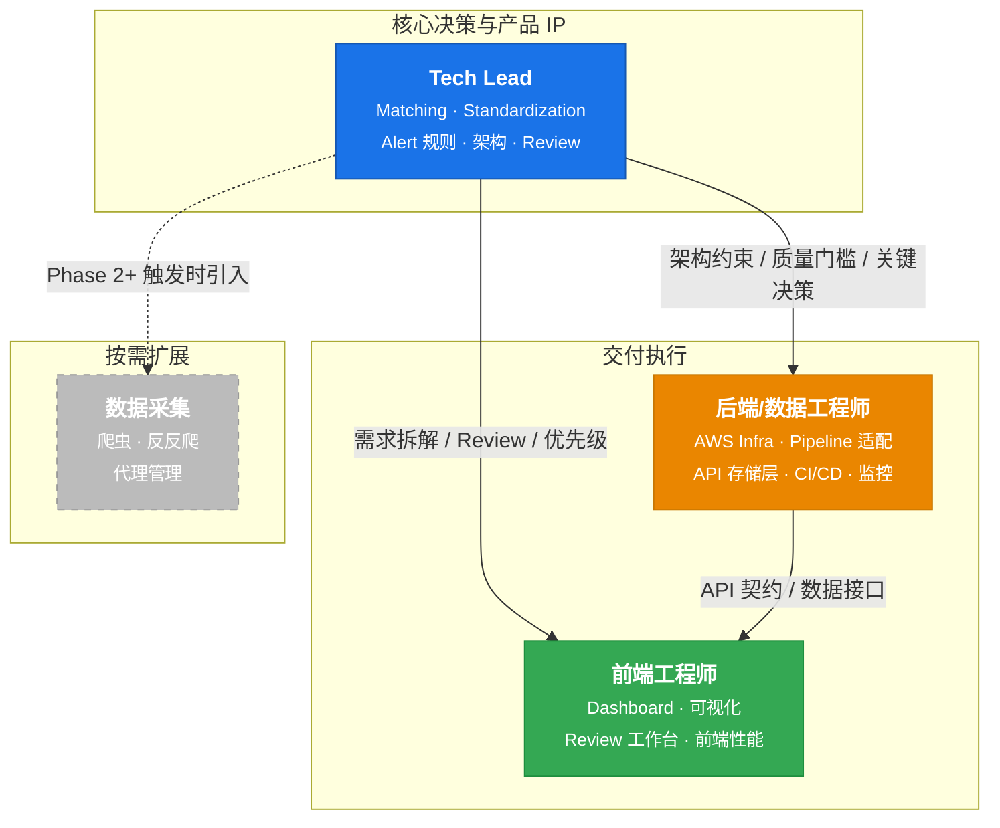
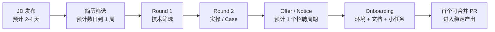
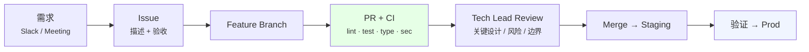

# Pricing Center — 招聘与面试执行方案

> v1.0.0 | 2026-03-06 | Ready for Execution

---

## 文件拆分说明

为便于直接发布和执行，JD 与面试评分表已拆分为独立文件：

- 前端 JD： [docs-spec-2/hiring/frontend-engineer-jd.md](docs-spec-2/hiring/frontend-engineer-jd.md)
- 后端 / 数据 JD： [docs-spec-2/hiring/backend-data-engineer-jd.md](docs-spec-2/hiring/backend-data-engineer-jd.md)
- 前端面试评分表： [docs-spec-2/hiring/frontend-engineer-scorecard.md](docs-spec-2/hiring/frontend-engineer-scorecard.md)
- 后端 / 数据面试评分表： [docs-spec-2/hiring/backend-data-engineer-scorecard.md](docs-spec-2/hiring/backend-data-engineer-scorecard.md)

本文保留招聘策略、协作方式和 onboarding 纲要；对外发布优先使用拆分后的 JD 文件，面试执行优先使用拆分后的评分表文件。

---

## TL;DR

**建议配置：1 名 Tech Lead + 2 名核心招聘成员 = 3 人团队**

| 角色                | 级别              | 月薪 (SGD) | 到岗目标 |
| ------------------- | ----------------- | ---------- | -------- |
| Tech Lead           | —                 | —          | 已配置   |
| 前端工程师          | Mid 3-5 年        | $6K - 9K   | 尽快到岗 |
| 后端/数据工程师     | Mid-Senior 4-6 年 | $8K - 12K  | 尽快到岗 |
| (Phase 2+) 数据采集 | Mid / 外包        | $5K - 8K   | 按需     |

**月人力成本：$14K - 21K SGD** (不含既有 Tech Lead)

> 原则：Matching / Standardization / Alert 由 Tech Lead 主导；前端 UI、AWS 基础设施、Pipeline 对接由工程成员负责。

---

## 1. 团队架构



### Tech Lead 时间分配

| 工作        | 占比 | 说明                               |
| ----------- | ---- | ---------------------------------- |
| 核心算法    | 40%  | Matching + Standardization + Alert |
| Code Review | 20%  | 所有关键 PR 由 Tech Lead 审核      |
| 架构决策    | 15%  | AWS 选型、存储方案                 |
| 供应商对接  | 10%  | 评估样本、技术对接                 |
| 团队管理    | 10%  | 面试、onboarding、进度             |
| 客户沟通    | 5%   | 技术方案、问题排查                 |

### 1.1 决策与汇报机制

| 事项                 | 最终拍板人 | 参与人               | 输出物              |
| -------------------- | ---------- | -------------------- | ------------------- |
| 候选人是否进入下一轮 | Tech Lead  | 当轮面试官           | 书面反馈            |
| Offer 是否发出       | Tech Lead  | 面试官 + HR/招聘协助 | Offer decision note |
| 薪资区间与级别       | Tech Lead  | HR/招聘协助          | Offer package       |
| 试用期是否转正       | Tech Lead  | 直属协作者           | 试用期评估          |

---

## 2. 前端工程师

### 概述

|          |                                                           |
| -------- | --------------------------------------------------------- |
| **级别** | Mid (3-5 年)                                              |
| **汇报** | 直接向 Tech Lead                                          |
| **模式** | 远程为主，每周 1 天线下 (同城)                            |
| **目标** | 把 MVP React 代码产品化，交付客户可用的 Pricing Dashboard |

### 职责

**Phase 1 (Month 1-2):** Dashboard 重构 · 核心可视化组件 (价格趋势/排名变化/跨平台对比) · Cognito 认证集成 · CloudFront 部署

**Phase 2 (Month 3-4):** Review 工作台优化 · Alert 页面增强 · 响应式 · 性能优化 (虚拟列表/Code Splitting)

### 能力模型

| 维度   | Must Have                              | Nice to Have                |
| ------ | -------------------------------------- | --------------------------- |
| 框架   | React 18/19 (Hooks, Context, Suspense) | Next.js                     |
| 语言   | TypeScript 严格模式                    | —                           |
| 可视化 | **Recharts 或 ECharts 精通**           | D3.js                       |
| 样式   | Tailwind CSS                           | CSS-in-JS                   |
| 数据   | TanStack Query 或 SWR                  | GraphQL                     |
| 状态   | Zustand 或 Redux Toolkit               | Jotai                       |
| 构建   | Vite                                   | Webpack                     |
| 认证   | 理解 OIDC/OAuth2                       | 对接过 Cognito/Auth0        |
| 测试   | Vitest + React Testing Library         | Playwright                  |
| 行业   | —                                      | B2B SaaS / Dashboard / 电商 |

### 面试

**Round 1 · 技术筛选 (45 min, 远程)**

| 时间 | 题目                                                                                                      | 考察               |
| ---- | --------------------------------------------------------------------------------------------------------- | ------------------ |
| 10m  | 自我介绍 + 项目                                                                                           | 沟通、项目复杂度   |
| 15m  | **Q1:** 200 SKU × 2 平台 × 30 天价格数据，设计 Dashboard 让用户快速发现异常和趋势。用什么图表？怎么布局？ | **数据可视化思维** |
| 10m  | **Q2:** React 列表 5000 行 × 10 列，可排序筛选。怎么实现？                                                | **性能优化**       |
| 10m  | **Q3:** 页面同时请求 3 个 API，1 个可能失败。用 TanStack Query 怎么处理？用户看到什么？                   | **异步 + UX**      |

**Round 2 · 实操 + Culture (60 min)**

| 时间 | 内容                                                            | 考察           |
| ---- | --------------------------------------------------------------- | -------------- |
| 30m  | Code Review MVP 组件 (`ReviewPairCard.tsx`)，指出改进并当场重构 | 代码审美、重构 |
| 15m  | 听完业务后提前端技术方案                                        | 系统思维       |
| 15m  | 工作方式偏好、分歧处理、质量标准                                | 团队匹配       |

**通过：** 平均 ≥3.5 / 5，无 1 分。评分：5=超出预期 4=符合 3=基本达标 2=不足 1=不达标

### JD

> **Frontend Engineer — Pricing Center (SEA E-commerce Intelligence)**
>
> We're building a competitive pricing intelligence platform for SEA e-commerce — tracking and analyzing product prices across Shopee, TikTok Shop, and Lazada.
>
> **You'll:** Build the Pricing Dashboard (data-rich React SPA) · Design data viz components · Ship to real customers in SEA
>
> **Stack:** React 19, TypeScript, Vite 6, Tailwind 4, TanStack Query 5, Zustand, Recharts, AWS (CloudFront + Cognito)
>
> **Need:** 3-5y React+TS · Strong data visualization · Dashboard experience · Startup comfort
>
> **Bonus:** B2B SaaS · OIDC/OAuth2 · Design eye
>
> **Comp:** SGD $6,000-9,000/mo · Remote-first (SEA timezone)

### 发布版 JD（可直接外发）

**职位名称：Frontend Engineer — Pricing Center（React / TypeScript / Dashboard）**

**我们在做什么**

我们正在做一个面向东南亚电商的 Pricing Center，核心能力是采集 Shopee / TikTok Shop / Lazada 的价格数据，做商品匹配、价格监控、异常发现和可视化分析，帮助客户做定价判断。

**你会负责**

- 将现有 MVP React 项目产品化，交付可给客户使用的 Dashboard
- 实现价格趋势、排名变化、跨平台对比等数据可视化模块
- 对接后端 API、登录认证和审核工作台
- 持续优化前端性能、可维护性和可测试性

**我们希望你具备**

- 3-5 年 React + TypeScript 经验
- 做过数据密集型 B2B Dashboard 或运营平台
- 熟悉图表组件与表格性能优化
- 能在需求不完全清晰时主动拆解问题并推进

**加分项**

- 做过 OIDC/OAuth2 登录接入
- 有电商、定价、BI、SaaS 产品经验
- 有 Figma 到前端落地经验

**工作方式**

- Remote-first，SEA 时区协作
- 直接与 Tech Lead 协作
- 真实业务、真实客户、快速上线

**薪资范围**

- SGD $6,000-9,000 / month

---

## 3. 后端 / 数据工程师

### 概述

|          |                                                  |
| -------- | ------------------------------------------------ |
| **级别** | Mid-Senior (4-6 年)                              |
| **汇报** | 直接向 Tech Lead                                 |
| **模式** | 远程为主，每周 1 天线下 (同城)                   |
| **目标** | 搭建 AWS 生产环境，MVP pipeline + API 适配到云端 |

### 职责

**Phase 1 (Month 1-2):** AWS 基础设施 (Terraform: VPC/ECS/RDS/S3/Athena/Cognito) · CI/CD · 第三方数据对接 (SFTP/API → S3) · API 适配 RDS + Athena

**Phase 2 (Month 3-4):** Pipeline 适配 S3 数据源 · 监控告警 · API 性能优化 · 安全加固

### 能力模型

| 维度   | Must Have                           | Nice to Have                   |
| ------ | ----------------------------------- | ------------------------------ |
| Python | 3+ 年，数据处理                     | pandas / polars                |
| AWS    | **ECS + S3 + RDS 实操**             | Step Functions / Athena / Glue |
| IaC    | **Terraform 生产级**                | Pulumi / CDK                   |
| SQL    | **PostgreSQL 精通** (索引/查询计划) | DuckDB / ClickHouse            |
| Docker | Dockerfile + 多阶段构建             | ECS task definition            |
| CI/CD  | GitHub Actions 或 GitLab CI         | ArgoCD                         |
| Java   | 能读改 Spring Boot                  | Spring Boot 项目经验           |
| 数据   | Parquet 使用经验                    | Arrow / Avro                   |
| 行业   | —                                   | ETL pipeline / 电商            |

### 面试

**Round 1 · 技术筛选 (45 min, 远程)**

| 时间 | 题目                                                                                                              | 考察           |
| ---- | ----------------------------------------------------------------------------------------------------------------- | -------------- |
| 10m  | 自我介绍 + 项目                                                                                                   | 沟通、AWS 深度 |
| 15m  | **Q1:** 设计每日 pipeline：SFTP CSV (50MB) → 清洗 → S3 Parquet → SQL 可查询。选什么技术？怎么编排？怎么处理失败？ | **ETL + AWS**  |
| 10m  | **Q2:** Fargate Task vs Service vs Lambda，分别适用什么？日批 Pipeline 用哪个？API 呢？                           | **AWS 理解**   |
| 10m  | **Q3:** PostgreSQL 500 万行，按 platform + category + date 过滤 + price 排序 + 分页，P95 <1s。怎么做？            | **查询优化**   |

**Round 2 · 实操 + Culture (60 min)**

| 时间 | 内容                                                                                | 考察       |
| ---- | ----------------------------------------------------------------------------------- | ---------- |
| 25m  | Terraform 实操：画架构图 + 写 Fargate+ALB+RDS 关键 resource 伪代码                  | IaC 实操   |
| 20m  | 故障排查：Pipeline 02:30 失败，Step Functions 显示 Standardization 超时。排查步骤？ | 系统化思维 |
| 15m  | 工作方式、独立性、质量标准                                                          | 团队匹配   |

**通过：** 平均 ≥3.5 / 5，Q1 ≥3

### JD

> **Backend / Data Engineer — Pricing Center (SEA E-commerce Intelligence)**
>
> We're building a competitive pricing intelligence platform for SEA e-commerce.
>
> **You'll:** Own AWS infrastructure (ECS/S3/RDS/Athena/Step Functions) · Build data pipeline (ingestion → standardization → matching → serving) · Adapt Spring Boot API to production · CI/CD + monitoring
>
> **Stack:** Python 3.12+, AWS (ECS Fargate, S3, RDS, Athena, Step Functions), Terraform, Docker, GitHub Actions, Spring Boot 3.4, Parquet
>
> **Need:** 4-6y backend/data · Hands-on AWS (ECS/S3/RDS) · Python + PostgreSQL · Terraform · Startup comfort
>
> **Bonus:** Step Functions/Airflow · Athena/Redshift/BigQuery · Java/Spring Boot · E-commerce
>
> **Comp:** SGD $8,000-12,000/mo · Remote-first (SEA timezone)

### 发布版 JD（可直接外发）

**职位名称：Backend / Data Engineer — Pricing Center（AWS / Python / Data Pipeline）**

**我们在做什么**

我们正在建设一个东南亚电商价格情报产品。系统会采集外部商品价格数据，完成标准化、匹配、告警和查询服务，并通过 Dashboard、API 和数据导出交付给客户。

**你会负责**

- 搭建 AWS 生产环境（ECS / S3 / RDS / Athena / Step Functions / Cognito）
- 将现有 Python pipeline 和 Spring Boot API 适配到生产环境
- 打通第三方数据 → 数据湖 → 查询服务 → 客户导出的链路
- 负责 CI/CD、监控告警、基础安全和上线稳定性

**我们希望你具备**

- 4-6 年后端或数据工程经验
- 对 AWS 的 ECS / S3 / RDS 有真实生产经验
- 熟悉 Python 数据处理和 PostgreSQL
- 能在小团队里独立推进一个模块到上线

**加分项**

- 做过 Step Functions / Airflow / Athena / Redshift / Glue
- 能读改 Java / Spring Boot
- 做过 ETL、价格、零售、电商相关系统

**工作方式**

- Remote-first，SEA 时区协作
- 直接与 Tech Lead 协作
- 负责从“本地能跑”推进到“生产可用”

**薪资范围**

- SGD $8,000-12,000 / month

---

## 4. 数据采集 (Phase 2+ 可选)

**触发条件：** 第三方覆盖不足 · 客户要求小时级更新 · 需要供应商不提供的字段

**Phase 1 不招：** 买数据覆盖核心需求 · Shopee API 对接可由后端兼做 · MVP 爬虫代码可临时顶

**能力要求 (参考)：** Python 爬虫精通 · 反反爬精通 · 代理池管理 · AWS Lambda/SQS · 合规意识

**也可 Freelancer/Contractor 模式**

---

## 5. 配置方案对比

|                | **方案 A: 3 人 ✅**     | 方案 B: 4 人 | 方案 C: 2 人              |
| -------------- | ----------------------- | ------------ | ------------------------- |
| 配置           | Tech Lead + 前端 + 后端 | + 爬虫       | Tech Lead (兼后端) + 前端 |
| 月成本         | **$14-21K**             | $19-29K      | $6-9K                     |
| 并行度         | 中                      | 高           | 低                        |
| 上线节奏       | **相对均衡**            | 更快         | 偏慢                      |
| Tech Lead 负担 | 适中                    | 轻           | **超负荷**                |
| 适用           | **Phase 1**             | Phase 2+     | 资金极紧                  |

> **路径：** A 启动 → Phase 2 按需升级 B

### 5.1 招聘优先顺序

1. 后端/数据工程师
2. 前端工程师
3. 数据采集工程师 / Freelancer

**原因：** 后端/数据工程师决定基础设施和数据链路是否能先落地；前端可在 API 和契约稳定后快速并行。

---

## 6. 能力覆盖

| 能力                 | Tech Lead | 前端 | 后端 | (爬虫) |
| -------------------- | :-------: | :--: | :--: | :----: |
| Matching 算法        |   ████    |      |      |        |
| Data Standardization |   ████    |      |      |        |
| Alert 规则           |   ████    |      |      |        |
| 架构设计             |   ████    |  ·   |  ··  |        |
| React / TypeScript   |    ··     | ████ |      |        |
| 数据可视化           |     ·     | ████ |      |        |
| Spring Boot          |    ███    |      |  ··  |        |
| Python               |   ████    |      | ████ |  ████  |
| AWS 基础设施         |    ███    |      | ████ |        |
| Terraform            |    ··     |      | ████ |        |
| SQL                  |   ████    |      | ████ |        |
| 爬虫                 |    ··     |      |  ·   |  ████  |

`████` 核心负责 &nbsp; `███` 可独立做 &nbsp; `··` 了解 &nbsp; `·` 基础

### 6.1 简历筛选标准（首轮）

| 维度       | 通过信号                                    | 淘汰信号                        |
| ---------- | ------------------------------------------- | ------------------------------- |
| 年限       | 接近目标年限且项目深度匹配                  | 只有年限，没有完整交付经历      |
| 项目复杂度 | 做过真实生产系统，有上线/监控/性能经验      | 只有 demo / 外包切图 / 课堂项目 |
| 独立性     | 能清楚说明自己负责范围与决策                | 全程只描述“团队做了什么”        |
| 技术匹配   | React Dashboard 或 AWS Data Pipeline 高相关 | 技术栈完全不相关                |
| 表达       | 能结构化讲问题、方案、结果                  | 表达混乱、无法解释取舍          |

**快速淘汰条件：**

- 无法接受 Remote-first + SEA 时区协作
- 没有任何可验证的线上/生产经验
- 明显偏大公司单一螺丝钉，不适应 startup 自驱环境
- 对岗位核心技术只有“用过一点”

---

## 7. 招聘

### 时间线



**目标：** 在可接受的招聘周期内完成到岗，并尽快进入稳定产出。

### 渠道

| 渠道          | 前端  | 后端  | 说明            |
| ------------- | :---: | :---: | --------------- |
| 内推          | ★★★★★ | ★★★★★ | 质量最高        |
| LinkedIn      | ★★★★  | ★★★★★ | SEA 技术圈活跃  |
| NodeFlair     | ★★★★  |  ★★★  | SG 本地，前端多 |
| Glints        | ★★★★  | ★★★★  | SEA 全覆盖      |
| Toptal/Upwork |  ★★   |  ★★   | 短期外包备选    |

### 7.1 招聘执行 SOP

| 步骤           | Owner                | SLA            | 输出               |
| -------------- | -------------------- | -------------- | ------------------ |
| 发布 JD        | Tech Lead / 招聘协助 | 尽快执行       | JD 链接 + 渠道列表 |
| 简历初筛       | Tech Lead / 招聘协助 | 尽快反馈       | shortlist / reject |
| Round 1 排期   | 招聘协助             | 72h 内         | 日历邀请           |
| Round 1 反馈   | 面试官               | 面后 24h 内    | scorecard          |
| Round 2 排期   | 招聘协助             | 通过后 48h 内  | 日历邀请           |
| Final decision | Tech Lead            | Round 2 后尽快 | hire / no hire     |
| Offer 发出     | Tech Lead / 招聘协助 | 决策后尽快     | offer              |

### 7.2 面试官分工

| 轮次              | 时长      | 面试官               | 目标                    |
| ----------------- | --------- | -------------------- | ----------------------- |
| Resume Screen     | 15 min    | Tech Lead / 招聘协助 | 判断是否值得进入 R1     |
| Round 1           | 45 min    | Tech Lead            | 技术深度 + 沟通 + 自驱  |
| Round 2           | 60 min    | Tech Lead            | 实操 / case / 文化匹配  |
| Reference（可选） | 15-20 min | Tech Lead            | 验证 ownership 与稳定性 |

### 7.3 面试评分卡（统一模板）

评分标准：1 = 明显不达标，2 = 偏弱，3 = 基本达标，4 = 明显胜任，5 = 超预期

| 维度     | 权重 | 说明                             |
| -------- | :--: | -------------------------------- |
| 技术深度 | 30%  | 是否真正做过，是否理解原理与取舍 |
| 问题拆解 | 20%  | 是否能把模糊问题拆成可执行步骤   |
| 独立推进 | 20%  | 是否能在少指导下推进到结果       |
| 沟通表达 | 15%  | 是否清晰、结构化、诚实           |
| 岗位匹配 | 15%  | 是否适合当前阶段与工作方式       |

**录用门槛：**

- 总分 ≥ 3.5 / 5
- `技术深度` 不低于 3
- `独立推进` 不低于 3
- 无明显 red flag

### 7.4 面试反馈模板（面后直接填写）

```markdown
候选人：
岗位：
轮次：
日期：

1. 技术深度（1-5）：
   证据：

2. 问题拆解（1-5）：
   证据：

3. 独立推进（1-5）：
   证据：

4. 沟通表达（1-5）：
   证据：

5. 岗位匹配（1-5）：
   证据：

Red flags：
亮点：

结论：Strong Hire / Hire / Lean No / No Hire
建议薪资区间：
```

---

## 8. Onboarding

### Day 1 (通用)

- [ ] 账号：GitHub org · AWS IAM · Slack
- [ ] 环境：Clone 9 repo，`make mvp-stub` 跑通
- [ ] 阅读：`docs-spec/README.md` → `docs-spec-2/architecture.md`
- [ ] 体验：localhost:3000 + localhost:8501 完整用户流程

### Day 2-5 (前端)

| Day | 任务                                               | 验收               |
| --- | -------------------------------------------------- | ------------------ |
| 2   | 阅读 `web-frontend/src/` + `openapi/api-v1.yaml`   | 画出前端模块关系图 |
| 3   | 阅读 hooks/ + api/ 层                              | 理解数据获取       |
| 3-4 | **小任务:** TopItemsTable 加 price range 筛选      | PR                 |
| 4-5 | **小任务:** OverviewPage 加品牌份额饼图 (Recharts) | PR                 |

### Day 2-5 (后端)

| Day | 任务                                                           | 验收         |
| --- | -------------------------------------------------------------- | ------------ |
| 2   | 阅读 `data-pipeline/` runner.py + 本地跑 pipeline+matching     | 画出数据流图 |
| 3   | 阅读 `api-backend/` controller → service → repo                | 理解分层     |
| 3-4 | 阅读 `infra-small-prod/terraform/`                             | 理解 IaC     |
| 4-5 | **小任务:** Terraform 创建 S3 bucket + Python 上传样本 Parquet | PR           |

### 试用期评估 (1 个月)

| 维度     | 达标                                         | 红灯               |
| -------- | -------------------------------------------- | ------------------ |
| 代码质量 | PR ≤2 轮 review 可 merge                     | 反复基础错误       |
| 独立性   | 根据文档独立完成，问题先查再问               | 每个小问题都需指导 |
| 产出     | 前端: 2 页面 / 后端: infra + 1 pipeline 适配 | 1 月无可合并 PR    |
| 沟通     | standup 清晰，阻塞时主动说                   | 长时间沉默         |
| 学习     | 1 周理解架构，2 周独立产出                   | 2 周后仍无法独立   |

### 8.1 首月 / 第二个月期望

| 时间     | 前端期望                                    | 后端期望                                   |
| -------- | ------------------------------------------- | ------------------------------------------ |
| 首月     | 能独立交付 1-2 个核心页面/组件并通过 review | 能独立推进 1 条数据链路或 1 组基础设施模块 |
| 第二个月 | 能对 Dashboard 关键模块独立负责             | 能对 Staging 环境某个子系统独立负责        |

---

## 9. 工作模式

### 工具

| 用途 | 工具                                 |
| ---- | ------------------------------------ |
| 代码 | GitHub Private Org                   |
| 沟通 | Slack / Lark (#dev #alerts #general) |
| 项目 | GitHub Issues + Projects             |
| 文档 | Markdown in repo                     |
| 设计 | Figma (前端自用)                     |
| 会议 | Google Meet / Zoom                   |

### 流程



### 节奏

| 频率   | 活动             | 形式               |
| ------ | ---------------- | ------------------ |
| 每日   | Async Standup    | Slack 文字 (5 min) |
| 每周   | Weekly Sync      | Video 30-60 min    |
| 每两周 | Sprint Review    | Demo + 回顾 60 min |
| 按需   | Pair Programming | Screen share       |

**Standup:** `Done: ... / Today: ... / Blocked: ...`

### 代码底线

- 所有关键 PR 由 Tech Lead review（Phase 1 建规范，Phase 2 可逐步放权）
- CI 全绿才能 merge
- OpenAPI 变更检查 breaking change (oasdiff)
- 禁止直接 push main
- Conventional Commits (`feat:` `fix:` `chore:`)

### 9.1 候选人沟通口径（统一）

- 我们是小团队，岗位需要强 ownership，不是纯执行岗
- 当前阶段最看重：独立推进、技术判断、上线意识
- 产品已具备 MVP，有真实业务场景，不是从 0 到 0.1 的空想阶段
- 直接协作者是 Tech Lead，反馈快，要求也高

---

## 10. 风险

| 风险                      | 概率 | 影响 | 应对                                                         |
| ------------------------- | :--: | :--: | ------------------------------------------------------------ |
| 招聘周期拉长              |  中  |  高  | 降级到 Junior + 增加 Tech Lead 带教；启用 Toptal；SEA 全范围 |
| 新人上手慢                |  中  |  中  | MVP 代码+文档齐全；结构化 onboarding；小任务验证             |
| Tech Lead review 成为瓶颈 |  高  |  中  | lint rule + PR template 建规范；CRUD 简化 review             |
| 前后端不同步              |  中  |  低  | OpenAPI spec 先行；前端 mock API 并行                        |
| 关键人离职                |  低  |  高  | 代码规范 + CI + 文档保证可接手                               |

---

## 11. 行动清单

| 优先级 | 行动                                 | 时间   |
| :----: | ------------------------------------ | ------ |
| **P0** | 确定招聘预算                         | 本周   |
| **P0** | 发布 JD (前端 + 后端)                | 本周   |
| **P0** | 联系数据供应商 (DataWeave + Prisync) | 本周   |
|   P1   | 简历筛选 + 面试                      | 下周起 |
|   P1   | AWS 账号 + 基础 VPC                  | 下周   |
|   P2   | 供应商样本评估                       | 2 周内 |
|   P2   | 发 Offer                             | 2-3 周 |
|   P3   | 新人 Onboard                         | 4-5 周 |

### 11.1 本周可直接执行的事项

- [ ] 冻结两个 JD 的对外版本
- [ ] 在 LinkedIn / Glints / 内推渠道同步发布
- [ ] 建立候选人跟踪表（姓名 / 渠道 / 轮次 / 结论 / 薪资预期）
- [ ] 准备 Round 1 与 Round 2 的日历模板
- [ ] 建立统一面试反馈模板
- [ ] 预留未来两周固定面试时段
