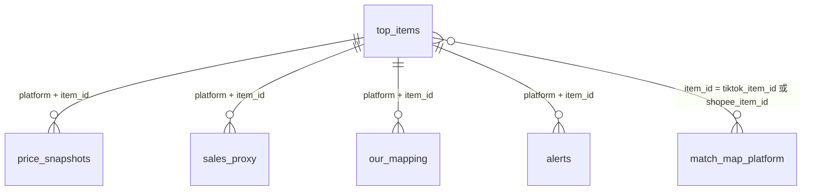

# 数据模型

> 版本: 2.0.0
> 最后更新: 2026-02-26
> 状态: 已接受

## 概述

数据模型包含 6 张 DuckDB 表，全部存储在单个 DuckDB 文件（`data-pipeline/data/pipeline.duckdb`）中。每张表通过复合主键支持幂等写入 —— 对同一日期重新运行流水线会安全覆盖之前的数据。

DDL 定义维护在 `data-pipeline/src/sea_pipeline/models/tables.py`。

## 表 1：`top_items`

存储标准化商品列表。每个商品每平台每排名位每天一行。这是替代早期 `raw_listings` + `standardized_products` 设计的主事实表。

```sql
CREATE TABLE IF NOT EXISTS top_items (
    event_date      DATE        NOT NULL,
    platform        VARCHAR     NOT NULL,   -- 'tiktok' | 'shopee'
    category        VARCHAR     NOT NULL,   -- 'personal_care'
    site            VARCHAR     NOT NULL,   -- 'TH'
    rank            INTEGER     NOT NULL,
    item_id         VARCHAR     NOT NULL,
    title           VARCHAR,
    url             VARCHAR,
    image_url       VARCHAR,
    brand_raw       VARCHAR,                -- 原始品牌字符串
    brand_std       VARCHAR,                -- 归一化后的标准品牌
    size_value      DOUBLE,                 -- 提取的数值规格
    size_unit       VARCHAR,                -- 'ml', 'g', 'oz' 等
    pack_count      INTEGER     DEFAULT 1,
    normalized_ml   DOUBLE,                 -- 转换为 ml
    normalized_g    DOUBLE,                 -- 转换为 g
    run_id          VARCHAR     NOT NULL,
    batch_id        VARCHAR     NOT NULL,
    ingested_at     TIMESTAMP   DEFAULT CURRENT_TIMESTAMP,
    PRIMARY KEY (event_date, platform, category, site, rank)
);
```

**幂等键**：`(event_date, platform, category, site, rank)` —— 同日再次采集按排名位覆盖。

**预估行数**：~400/次运行（200 商品 × 2 平台）。

## 表 2：`price_snapshots`

存储每日商品价格数据。价格以 **satang**（泰铢最小单位，1 THB = 100 satang）为整数存储，避免浮点精度问题。

```sql
CREATE TABLE IF NOT EXISTS price_snapshots (
    event_date      DATE        NOT NULL,
    platform        VARCHAR     NOT NULL,
    item_id         VARCHAR     NOT NULL,
    price           INTEGER     NOT NULL,   -- 价格，单位 satang（THB × 100）
    promo_price     INTEGER,                -- 促销价格，单位 satang
    currency        VARCHAR     NOT NULL,   -- 始终为 'THB'
    price_per_ml    DOUBLE,                 -- 单位价格：satang/ml
    price_per_g     DOUBLE,                 -- 单位价格：satang/g
    run_id          VARCHAR     NOT NULL,
    batch_id        VARCHAR     NOT NULL,
    captured_at     TIMESTAMP   DEFAULT CURRENT_TIMESTAMP,
    PRIMARY KEY (event_date, platform, item_id)
);
```

**幂等键**：`(event_date, platform, item_id)` —— 每商品每天一条价格记录。

**预估行数**：~400/次运行。

## 表 3：`sales_proxy`

存储销售代理指标。每商品每天可有多种代理类型（rank、sold、review_count、likes 等）。

```sql
CREATE TABLE IF NOT EXISTS sales_proxy (
    event_date      DATE        NOT NULL,
    platform        VARCHAR     NOT NULL,
    item_id         VARCHAR     NOT NULL,
    proxy_type      VARCHAR     NOT NULL,   -- 'rank' | 'sold' | 'sold_range' | 'review_count' | 'likes' | 'comments' | 'rating'
    proxy_value     VARCHAR,                -- 字符串表示
    proxy_numeric   DOUBLE,                 -- 解析后的数值
    run_id          VARCHAR     NOT NULL,
    batch_id        VARCHAR     NOT NULL,
    ingested_at     TIMESTAMP   DEFAULT CURRENT_TIMESTAMP,
    PRIMARY KEY (event_date, platform, item_id, proxy_type)
);
```

**幂等键**：`(event_date, platform, item_id, proxy_type)` —— 每商品每天每代理类型一个值。

**代理类型**：`rank`、`sold`、`sold_range`、`review_count`、`likes`、`comments`、`rating`。

**预估行数**：~800/次运行（每商品 2-3 种代理类型）。

## 表 4：`match_map_platform`

存储匹配引擎的跨平台匹配结果。每行代表一个 TikTok-Shopee 商品对，包含匹配分类和置信度分数。

```sql
CREATE TABLE IF NOT EXISTS match_map_platform (
    tiktok_item_id      VARCHAR     NOT NULL,
    shopee_item_id      VARCHAR     NOT NULL,
    match_type          VARCHAR,        -- 'exact_same' | 'variant_family' | 'similar' | 'no_match'
    confidence          DOUBLE,         -- 综合得分 [0.0, 1.0]
    status              VARCHAR,        -- 'auto_accepted' | 'needs_review' | 'no_match' | 'overridden'
    reasons             VARCHAR,        -- JSON 字符串，匹配理由
    rule_version        VARCHAR,
    model_version       VARCHAR,
    event_date          DATE,
    batch_id            VARCHAR,
    run_id              VARCHAR     NOT NULL,
    ingested_at         TIMESTAMP   DEFAULT CURRENT_TIMESTAMP,
    schema_version      VARCHAR     DEFAULT '1.0.0',
    PRIMARY KEY (tiktok_item_id, shopee_item_id)
);
```

**幂等键**：`(tiktok_item_id, shopee_item_id)` —— 每跨平台配对一条记录。

**状态值**：
- `auto_accepted`：置信度 ≥ 0.85，自动接受。
- `needs_review`：置信度 0.65–0.85，需人工审核。
- `no_match`：置信度 < 0.65（仅在显式路由时存储）。
- `overridden`：通过审核工作流应用了人工覆盖。

**理由格式**（JSON 字符串）：
```json
{
  "strong_evidence": ["品牌精确匹配: NIVEA", "规格匹配: 500ml"],
  "weak_evidence": ["标题相似度: 0.72"],
  "field_alignment": {
    "brand_match": true, "brand_a": "NIVEA", "brand_b": "NIVEA",
    "spec_match": true, "spec_a": "500ml", "spec_b": "500ml",
    "title_similarity": 0.72, "price_band_match": true
  },
  "missing_fields": []
}
```

**预估行数**：~200/次运行（400 个商品中的匹配对）。

## 表 5：`our_mapping`

存储内部 SKU 映射数据。通过 CRUD API 端点管理。用于追踪哪些电商平台商品对应运营方自有产品目录。

```sql
CREATE TABLE IF NOT EXISTS our_mapping (
    platform            VARCHAR     NOT NULL,   -- 'tiktok' | 'shopee'
    item_id             VARCHAR     NOT NULL,
    our_status          VARCHAR     NOT NULL,   -- 'covered' | 'not_covered' | 'harvestable' | 'not_recommended'
    our_sku_id          VARCHAR,                -- 内部 SKU 引用
    notes               VARCHAR,
    updated_by          VARCHAR,                -- 最后更新者
    updated_at          TIMESTAMP   DEFAULT CURRENT_TIMESTAMP,
    schema_version      VARCHAR     DEFAULT '1.0.0',
    PRIMARY KEY (platform, item_id)
);
```

**幂等键**：`(platform, item_id)` —— 每商品一条映射。

**状态值**：
- `covered`：商品已在我方目录中。
- `not_covered`：不在我方目录中，可添加的机会。
- `harvestable`：高潜力商品，值得引入。
- `not_recommended`：已审核并拒绝。

**写入路径**：POST `/api/v1/our-mapping/{platform}/{itemId}`，带审计日志。

## 表 6：`alerts`

存储流水线执行期间检测到的异常和机会告警。

```sql
CREATE TABLE IF NOT EXISTS alerts (
    alert_id        VARCHAR     NOT NULL,
    event_date      DATE        NOT NULL,
    platform        VARCHAR     NOT NULL,
    item_id         VARCHAR     NOT NULL,
    alert_type      VARCHAR     NOT NULL,   -- 'rank_jump' | 'proxy_spike' | 'platform_gap' | 'price_anomaly'
    severity        VARCHAR     NOT NULL,   -- 'critical' | 'high' | 'medium' | 'low'
    status          VARCHAR     DEFAULT 'open',  -- 'open' | 'acknowledged' | 'resolved' | 'dismissed'
    message         VARCHAR,
    details         VARCHAR,                -- JSON 字符串，告警特定数据
    suggested_action VARCHAR,
    run_id          VARCHAR     NOT NULL,
    created_at      TIMESTAMP   DEFAULT CURRENT_TIMESTAMP,
    PRIMARY KEY (alert_id)
);
```

**幂等键**：`alert_id`（每个告警事件生成 UUID）。

**告警类型**：详见 [system-design.md 模块 4](system-design.md#模块-4告警检测) 的检测逻辑和阈值。

**预估行数**：~20/次运行。

## 跨表关系



### 关联键

| 源表 | 目标表 | 关联条件 |
|-----|-------|---------|
| `top_items` | `price_snapshots` | `platform = platform AND item_id = item_id AND event_date = event_date` |
| `top_items` | `sales_proxy` | `platform = platform AND item_id = item_id AND event_date = event_date` |
| `top_items` | `match_map_platform` | `item_id = tiktok_item_id`（TikTok 商品）或 `item_id = shopee_item_id`（Shopee 商品） |
| `top_items` | `our_mapping` | `platform = platform AND item_id = item_id` |
| `top_items` | `alerts` | `platform = platform AND item_id = item_id AND event_date = event_date` |

## 分区策略

DuckDB 不使用显式分区。但所有查询都按 `event_date` 过滤以实现高效扫描。复合主键确保高效查找和幂等更新。

生产环境迁移到 ClickHouse 时，表将使用：
- `MergeTree` 引擎，按 `(event_date, platform, item_id)` 排序
- 按 `toYYYYMM(event_date)` 分区，用于保留管理

### 行数汇总

| 表名 | 每次运行行数 | 增长模式 |
|-----|-----------|---------|
| `top_items` | ~400 | 每日覆盖 |
| `price_snapshots` | ~400 | 每日覆盖 |
| `sales_proxy` | ~800 | 每日覆盖 |
| `match_map_platform` | ~200 | 每次匹配运行覆盖 |
| `our_mapping` | 可变 | 追加（CRUD） |
| `alerts` | ~20 | 每次运行追加 |

## Schema 演进

Schema 变更遵循 [versioning/version-strategy.md](../versioning/version-strategy.md) 中的版本策略。关键规则：

- 添加可空列是次版本号升级（向后兼容）。
- 变更列类型或删除列是主版本号升级（破坏性变更）。
- 带 `schema_version` 列的表（`match_map_platform`、`our_mapping`）支持迁移期间混合版本读取。
- DDL 集中维护在 `data-pipeline/src/sea_pipeline/models/tables.py`，通过 `CREATE TABLE IF NOT EXISTS` 在流水线启动时应用。
