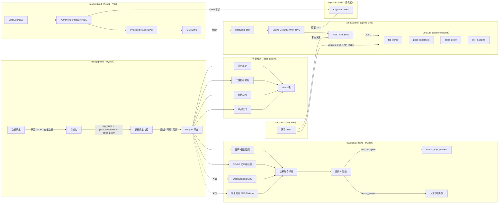

# 系统设计

> 版本: 2.0.0
> 最后更新: 2026-02-26
> 状态: 已接受

## 概述

SEA Retailer Intelligence Platform 是一个批处理数据流水线，包含六大模块。数据从采集经过标准化、匹配、告警检测，最终通过 REST API 和两个前端应用（React Web 应用 + Streamlit 演示应用）对外提供服务。

## 架构图



### 数据流摘要

```
数据采集（存根 / 实时）
  → 标准化（品牌归一、规格提取、价格转 satang，含标准化缓存）
  → 数据质量门控（16 项检查，阻断 / 降级 / 警告）
  → Parquet 导出（data/serving/*.parquet）
  → DuckDB 加载（6 张表）
  → 匹配引擎（4 种召回策略 → 加权融合打分 → 分类）
  → 告警检测（rank_jump、proxy_spike、price_anomaly、platform_gap）
  → API 后端（Spring Boot REST，9 个端点，限流 + JWT/RBAC）
  → Keycloak OIDC 认证（JWT 签发与验证）
  → Web 前端（React SPA，OIDC+PKCE 登录，错误边界 + Sentry 上报）
  → Streamlit 演示（5 个页面）
```

## 模块 1：数据采集

### 职责

从 Shopee Thailand 和 TikTok Shop Thailand 获取商品上架数据，存储原始响应并在同一流程中完成标准化。

### 数据流

1. 定时任务触发每日执行（或通过 Streamlit UI / CLI 手动触发）。
2. 对每个 (platform, category, site) 组合，获取 TopN 畅销商品列表。
3. 应用平台特定的提取器解析 title、brand、price、size、review count。
4. 将结果写入 DuckDB 表：`top_items`、`price_snapshots`、`sales_proxy`。
5. 输出运行元数据（run_id、batch_id、event_date）用于可追溯性。

### 关键设计决策

- **存根模式**：MVP 默认模式。使用预生成的 200 个商品/平台 YAML 固定数据，无需网络。
- **实时模式**：尽力抓取，失败时自动回退到存根数据。
- **幂等执行**：每次运行通过 DuckDB `INSERT OR REPLACE` 覆盖相同 `(event_date, platform, category, site)` 元组的数据。
- **可配置范围**：YAML 配置文件控制 `top_n`、`window_days`、`categories`、`sites`。

### 错误处理

| 错误类型 | 处理方式 |
|---------|---------|
| HTTP 429 | 降低 50% 速率，按 `Retry-After` 头或默认 60 秒后重试 |
| HTTP 403 | 轮换代理，最多重试 3 次，然后标记平台为降级状态 |
| HTTP 5xx | 标准指数退避重试 |
| 超时 | 递增超时重试（30s → 60s → 120s） |
| 解析错误 | 记录原始响应，标记为 `parse_failed`，继续处理 |

## 模块 2：标准化

### 职责

将原始商品数据转换为统一 Schema 的规范化字段。

### 标准化规则

- **品牌归一**：将已知品牌别名映射到标准名称（`brand_raw` → `brand_std`），未知品牌使用 RapidFuzz 模糊匹配。
- **价格归一**：转换为整数 satang（泰铢最小单位，1 THB = 100 satang），存储在 `price_snapshots.price`。
- **规格提取**：基于正则从标题中提取（如 "500ml"、"200g"），归一化为 `size_value` + `size_unit`，计算 `normalized_ml` / `normalized_g`。
- **单价计算**：在 `price_snapshots` 中计算 `price_per_ml` 和 `price_per_g`，用于跨商品比较。
- **多包检测**：从标题中提取多包信息（如 "3-pack"）存入 `pack_count`。

### 标准化缓存

标准化模块通过 `StandardisationCache` 缓存已处理标题的结果（品牌归一 + 规格提取），避免对重复标题的重复计算。

| 参数 | 值 |
|-----|---|
| 存储格式 | JSON 文件（`data/std_cache.json`） |
| 最大条目 | 10,000 |
| 淘汰策略 | LRU（最近最少使用） |
| 缓存键 | 小写化 + 合并空白后的标题文本 |
| 缓存值 | `(brand_std, ParsedSpec{size_value, size_unit, pack_count, normalized_value, normalized_unit})` |

每次流水线运行时：
1. `_standardise_item()` 先查缓存 → 命中则直接使用缓存结果
2. 未命中则执行完整标准化流程，计算后存入缓存
3. 流水线结束前调用 `std_cache.save()` 持久化到磁盘，超出上限时 LRU 修剪

### 数据质量门控

标准化完成后，执行 16 项数据质量检查，分三个级别：

| 级别 | 阈值 | 动作 |
|-----|------|-----|
| **阻断** | title 缺失 > 5% | 完全阻止 Parquet 导出 |
| **降级** | brand 缺失 > 20%，price 缺失 > 10% | 设置 `dq_status=degraded`，继续导出但带警告 |
| **警告** | 任何字段缺失 > 5% | 记录警告日志，不阻断 |

数据质量状态通过 API 的 `metadata.dq_status` 传播到 OverviewResponse，前端通过 `DegradedBanner` 组件展示。

## 模块 3：匹配

### 职责

跨平台匹配商品（Shopee ↔ TikTok），实现跨平台比价和对标。详细算法见 [matching-design.md](matching-design.md)。

### 数据流

1. 从 DuckDB `top_items` 表读取标准化商品。
2. 使用 4 种召回策略（可配置组合）生成候选对：
   - **品牌+品类阻隔**：同品牌同品类的商品间比较（默认启用）
   - **TF-IDF 文本相似度**：余弦相似度预过滤（默认启用，top_k=20，min_similarity=0.3）
   - **OpenSearch BM25**：全文检索召回，品牌字段加权（可选，需启动 OpenSearch 服务）
   - **向量召回**：sentence-transformers 编码 + FAISS/Milvus 近邻检索（可选，需启动向量服务）
3. 对每个候选对使用加权融合打分（brand 0.30、title 0.30、spec 0.25、price 0.15）。
4. 分类：`exact_same`、`variant_family`、`similar`、`no_match`。
5. 路由：auto_accept（≥0.85）→ `match_map_platform`；needs_review（0.65–0.85）→ 审核队列；auto_reject（<0.65）。
6. 如有人工覆盖 JSON 文件，应用覆盖合并。
7. 将结果写入 DuckDB `match_map_platform` 表。
8. 生成评估报告（`reports/report_{run_id}.md`）。

### 输出

- `match_map_platform`：所有打分和分类后的配对（auto_accepted + needs_review）。
- 审核队列项：状态为 `needs_review` 的配对，通过 API/UI 供人工决策。
- 评估报告：Markdown 文件，包含分布统计和样本配对。

## 模块 4：告警检测

### 职责

检测数据中的异常和机会点。告警在流水线执行期间生成，存储在 `alerts` 表中。

### 告警类型

| 告警类型 | 检测逻辑 | 严重级别 |
|---------|---------|---------|
| `rank_jump`（排名跳变） | 连续运行之间排名变化 ≥ 50 位 | ≥100 位为 `high`，否则 `medium` |
| `proxy_spike`（代理指标飙升） | review_count、likes 或 sold 代理增长 > 50% | ≥100% 增长为 `high`，否则 `medium` |
| `price_anomaly`（价格异常） | 价格为零/负数，或 > 3 倍 / < 0.2 倍品类中位数 | 零/负数为 `high`，否则 `medium` |
| `platform_gap`（平台缺口） | 品牌在一个平台进入 top-50 但在另一个平台缺失或排名 > 150 | `medium` |

### 告警生命周期

```
open → acknowledged → resolved
         ↘ dismissed
```

告警创建时状态为 `open`，可通过 API `/alerts` 端点管理。

## 模块 5：服务层（API 后端）

### 职责

通过 REST API 向前端消费者暴露流水线数据。提供 9 个端点，支持分页、幂等写入和审计日志。

### 实现细节

- **框架**：Spring Boot 3.4.2（Java 21，Maven）
- **数据库**：DuckDB via JDBC（本地配置直接读取 `pipeline.duckdb`）
- **端口**：8080（本地开发）
- **分页**：偏移量分页（`limit` + `offset` 参数）
- **审计**：AuditService 记录所有写操作（谁 / 何时 / 旧值 / 新值 / 备注）
- **幂等性**：`Idempotency-Key` 请求头 + 数据库唯一约束

详细端点规格见 [api-design.md](api-design.md)。

### 认证与授权（OIDC/JWT + RBAC）

API 后端通过 Spring Security OAuth2 Resource Server 实现基于 JWT 的认证和 RBAC。

```
[Keycloak :8180]
  → 签发 JWT（realm: sea-retailer）
  → realm_access.roles 包含角色列表
  → Spring Security 验证 JWT 签名 + 提取角色
  → 映射到 ROLE_VIEWER / ROLE_REVIEWER / ROLE_ADMIN
```

| 环境 | 认证方式 | 配置类 |
|-----|---------|--------|
| 本地（`local` profile） | 无认证，所有端点开放 | `SecurityConfig @Profile("local")` |
| 生产 | JWT Bearer + RBAC | `SecurityConfig @Profile("!local")` |

**RBAC 权限矩阵**：

| 角色 | GET /api/v1/** | POST /review/** | POST /our-mapping/** | 其他管理操作 |
|-----|---------------|----------------|---------------------|------------|
| `VIEWER` | 允许 | 拒绝 | 拒绝 | 拒绝 |
| `REVIEWER` | 允许 | 允许 | 允许 | 拒绝 |
| `ADMIN` | 允许 | 允许 | 允许 | 允许 |

**Keycloak 角色转换**：`SecurityConfig.KeycloakRoleConverter` 从 JWT 的 `realm_access.roles` 字段提取角色列表，映射为 Spring Security 的 `ROLE_` 前缀格式。

### 限流（Rate Limiting）

API 后端通过 `RateLimitFilter` 实现固定窗口限流，防止单一客户端过度消耗资源。

| 参数 | 值 |
|-----|---|
| 算法 | 固定窗口（每分钟重置） |
| 限制 | 100 请求/分钟/客户端 IP |
| IP 提取 | 优先 `X-Forwarded-For`，兜底 `remoteAddr` |
| 豁免路径 | `/healthz`、`/actuator`、`/swagger-ui`、`/api-docs` |
| 超限响应 | `429 Too Many Requests` + `Retry-After` 头 |

**响应头**：

| Header | 描述 |
|--------|-----|
| `X-RateLimit-Limit` | 窗口内的最大请求数（100） |
| `X-RateLimit-Remaining` | 当前窗口内的剩余请求数 |
| `Retry-After` | 超限时，等待重试的秒数 |

## 模块 6：展示层

### Web 前端（React）

主要用户界面，用于数据浏览和审核工作流。

| 属性 | 详情 |
|-----|------|
| 框架 | React 19 + Vite 6 |
| 语言 | TypeScript 5.7 |
| 样式 | Tailwind CSS 4 |
| 状态管理 | TanStack React Query 5（服务端状态）+ Zustand 5（UI 状态） |
| 图表 | Recharts 2.15 |
| 路由 | React Router 7 |
| 端口 | 3000（开发环境） |

**主要页面**（5 个路由）：

| 路径 | 页面 | 所需角色 |
|-----|------|--------|
| `/` | 概览仪表盘 | VIEWER / REVIEWER / ADMIN |
| `/top-items` | 畅销商品浏览器（含侧边详情抽屉） | VIEWER / REVIEWER / ADMIN |
| `/items/:platform/:itemId` | 商品详情页 | VIEWER / REVIEWER / ADMIN |
| `/alerts` | 告警列表 | VIEWER / REVIEWER / ADMIN |
| `/review` | 审核队列（含决策表单） | REVIEWER / ADMIN |

**前端认证（OIDC + PKCE）**：

前端通过 `AuthContext` 实现完整的 OIDC Authorization Code + PKCE 登录流程：

- **AuthProvider**：管理 token 存储（localStorage）、自动刷新（过期前 60 秒）、角色解析
- **ProtectedRoute**：路由保护组件，检查认证状态和角色权限
- **本地开发模式**：`VITE_AUTH_DISABLED=true` 时跳过认证，模拟 ADMIN 角色用户
- **OIDC 提供者**：Keycloak（`http://localhost:8180/realms/sea-retailer`）

**可观测性**：

- **ErrorBoundary**：React 错误边界组件，捕获组件树中的未处理异常，调用 `reportError()` 上报后展示降级 UI
- **reporter.ts**：零依赖错误上报模块，通过 Sentry Envelope API（`sendBeacon` / `fetch`）发送错误到 Sentry。无需安装 `@sentry/browser` SDK
  - `reportError(error, context?)`：上报错误
  - `trackEvent(name, data?)`：追踪业务事件（review_decision、our_mapping_update、page_view、alert_viewed）
  - 全局监听 `window.error` 和 `unhandledrejection` 事件
- **配置**：通过 `VITE_SENTRY_DSN` 环境变量启用 Sentry，未配置时回退到 console 输出

### Streamlit 演示应用

轻量级演示应用，无需完整 Web 栈即可快速浏览数据。

| 属性 | 详情 |
|-----|------|
| 框架 | Streamlit 1.54 |
| 图表 | Plotly Express |
| 数据访问 | 直接读取 DuckDB + API POST 提交审核决策 |
| 端口 | 8501 |

**5 个页面**：
1. **概览** — KPI 卡片、重叠图表、价格区间分布、Top 品牌、可追溯元数据
2. **畅销商品** — 可浏览商品表格，支持平台/品牌/价格筛选
3. **告警** — 告警列表，支持严重级别/类型/状态筛选
4. **审核** — 匹配对审核，支持 accept/reject/change_type，POST 到 API
5. **运行流水线** — 配置并通过子进程触发 pipeline + matching，支持 YAML 覆盖

## 存储架构

### 单一数据库：DuckDB（`pipeline.duckdb`）

MVP 阶段所有数据存储在单个 DuckDB 文件中，提供零配置本地开发环境，支持 SQL 接口和 Parquet 互操作。

### 表结构

| 表名 | 层级 | 描述 | 每次运行行数 |
|-----|------|------|-----------|
| `top_items` | Silver | 标准化商品列表 | ~400 |
| `price_snapshots` | Silver | 每日商品价格数据 | ~400 |
| `sales_proxy` | Silver | 销售代理指标（排名、销量、评论数、点赞数） | ~800 |
| `match_map_platform` | Silver | 跨平台匹配结果 | ~200 |
| `our_mapping` | Gold | 内部 SKU 映射（CRUD） | 可变 |
| `alerts` | Gold | 检测到的异常和机会点 | ~20/次 |

### Parquet 导出层

流水线同时导出数据到 `data/serving/*.parquet` 文件，供 Streamlit 应用消费和归档。

### 生产环境路径（未来）

```
[生产环境]
  - 存储：S3（Parquet 归档）+ ClickHouse（服务层）
  - API：Spring Boot on ECS Fargate，ALB 前置
  - UI：React SPA on S3 + CloudFront
  - 流水线：Docker 容器，ECS 定时任务
```

## 技术栈

| 组件 | 技术 | 版本 | 选型理由 |
|-----|------|-----|---------|
| 流水线 + 告警 | Python + DuckDB + Pandas | Python 3.14, DuckDB 1.1 | 轻量，MVP 无需 Airflow 开销 |
| 匹配引擎 | Python + RapidFuzz + scikit-learn TF-IDF | Python 3.14 | 快速模糊匹配，成熟文本相似度 |
| 存储（本地） | DuckDB | 1.1.3 | 零配置，Parquet 原生，SQL 接口 |
| 存储（生产） | ClickHouse | — | 快速分析查询，列式存储 |
| API 后端 | Spring Boot + DuckDB JDBC | 3.4.2, Java 21 | 类型安全 REST，丰富生态，审计支持 |
| Web 前端 | React + Vite + TypeScript + Tailwind CSS | React 19, Vite 6, TS 5.7, TW 4 | 快速开发迭代，现代工具链 |
| 演示 UI | Streamlit + Plotly | 1.54 | 快速原型，零构建演示 |
| 契约 | OpenAPI 3.1 + JSON Schema | — | 代码生成，跨仓库类型安全 |

## 部署拓扑（MVP）

```
[本地开发机]
  ┌─────────────────────────────────────────────┐
  │  data-pipeline（.venv）                      │
  │    → DuckDB 文件（pipeline.duckdb）          │
  │    → Parquet 文件（data/serving/）           │
  │    → 标准化缓存（data/std_cache.json）       │
  ├─────────────────────────────────────────────┤
  │  matching-engine（.venv）                    │
  │    → 读写 DuckDB                            │
  │    → 评估报告（reports/report_*.md）         │
  │    → 可选：OpenSearch :9200 / Milvus :19530  │
  ├─────────────────────────────────────────────┤
  │  Keycloak（OIDC :8180）                      │
  │    → 签发 JWT（realm: sea-retailer）         │
  ├─────────────────────────────────────────────┤
  │  api-backend（Spring Boot :8080）            │
  │    → JDBC 读取 DuckDB                       │
  │    → RateLimitFilter（100 req/min/IP）       │
  │    → JWT 认证 + RBAC（本地模式跳过）         │
  ├─────────────────────────────────────────────┤
  │  web-frontend（Vite 开发服务器 :3000）       │
  │    → OIDC+PKCE 登录（本地模式跳过）          │
  │    → ErrorBoundary + Sentry 上报（可选）     │
  │    → 从 API :8080 获取数据                   │
  ├─────────────────────────────────────────────┤
  │  app-mvp（Streamlit :8501）                  │
  │    → 直接读取 DuckDB                        │
  │    → POST 审核决策到 API :8080               │
  └─────────────────────────────────────────────┘
```

### 数据质量状态传播链路

```
数据质量门控（pipeline）
  → DuckDB 元数据中的 dq_status 字段
  → API：OverviewResponse 中的 metadata.dq_status
  → Web 前端：DegradedBanner 组件（黄色警告条）
  → Streamlit：概览页面的 st.warning("Data Quality: ...")
```
